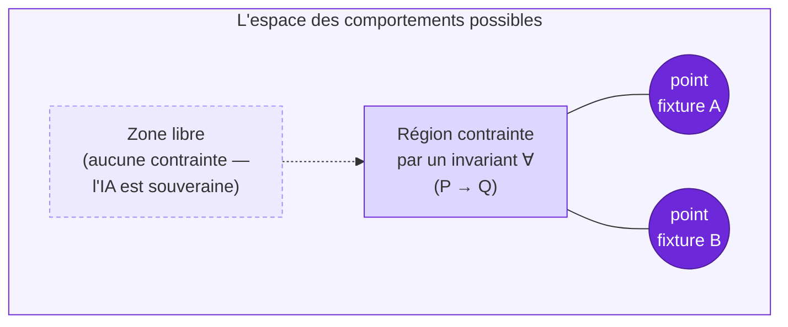
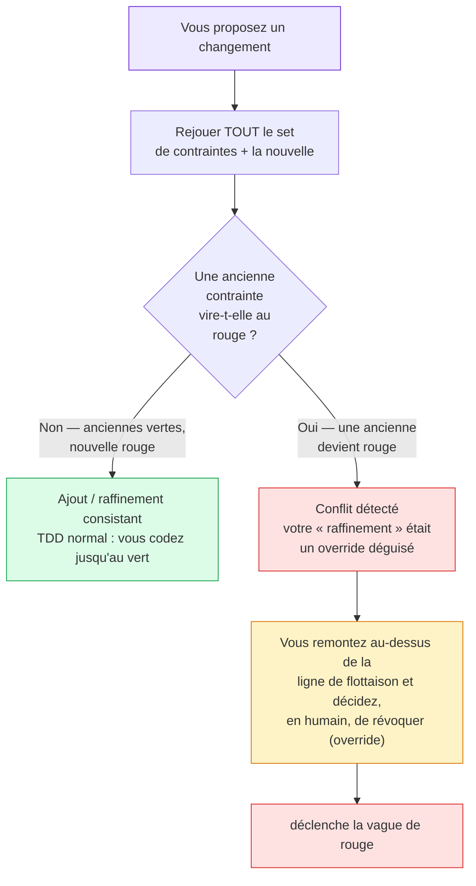
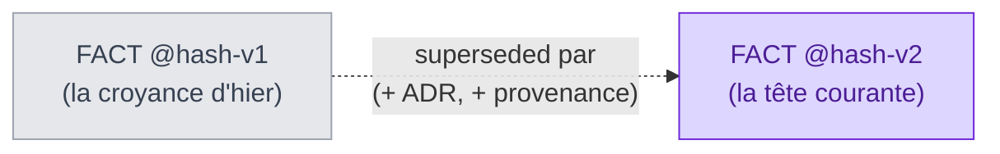
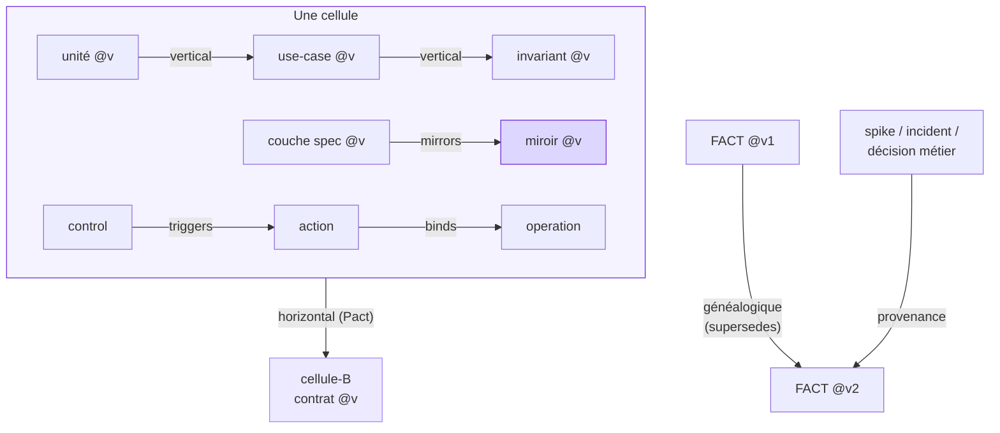
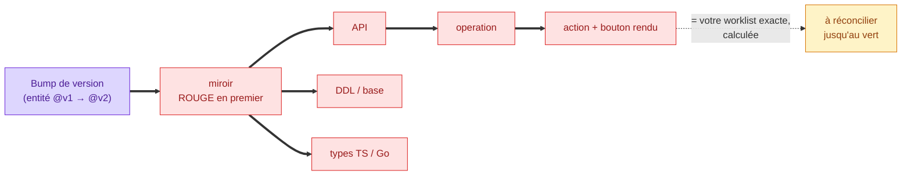
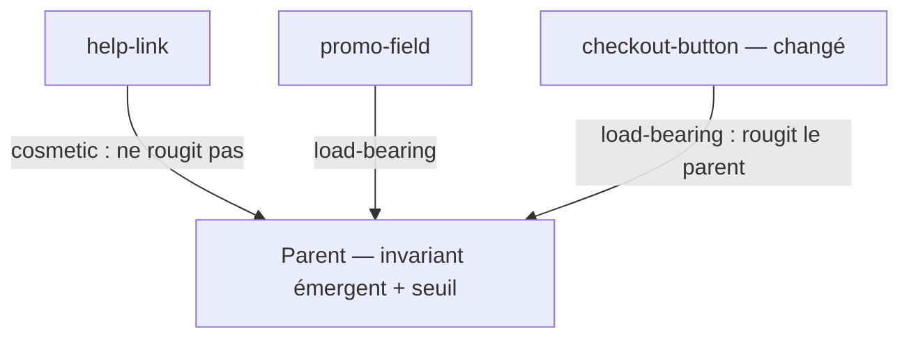
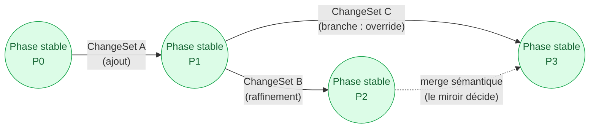
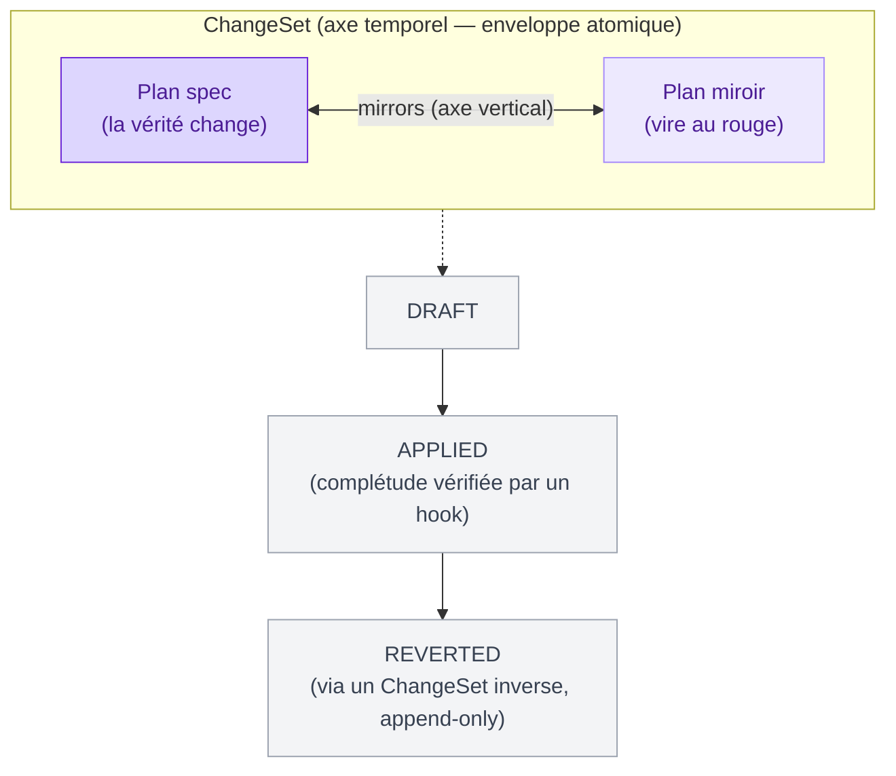

<Note>
  Côté concept — aucune ligne de code. Cette page explique *comment KRD pense le comportement et le changement*. Pour la mécanique d'implémentation (le mur, le cliquet), voir [Pour moi → Le mur et le cliquet](/internals/the-wall-and-ratchet).
</Note>

## En une phrase

Un comportement n'est pas un bloc qu'on fige ; c'est un **espace** qu'on contraint progressivement. Vous n'écrasez jamais une vérité : vous **dérivez** une nouvelle version (append-only, content-addressed). Quand vous bougez une vérité, son miroir vire au rouge en premier, puis la **vague de rouge** se propage à travers les couches et vous donne, calculée, la liste exacte de ce qui reste à réconcilier — jusqu'à la prochaine **phase stable**.

<Tip>
  La phrase à retenir : **« dérive, n'écris pas »**. Le cliquet n'interdit pas le changement — il interdit le changement *non-versionné*.
</Tip>

## Un comportement est un espace contraint

Définissons « comportement » assez précisément pour qu'il soit manipulable : **un comportement = une application `situation → résultat`**. Par exemple : « commande pré-reprise, produit conforme, demande de remboursement → pas d'obligation légale, décision commerciale, avoir ».

KRD ne fige pas un comportement d'un seul coup. Il pose des **contraintes** sur l'espace de tous les comportements possibles, une à la fois. Partout où aucune contrainte n'a été posée, l'espace reste **ouvert** — et c'est là que l'IA est libre, et que le comportement neuf vient s'ajouter.

Deux formes de contrainte, deux géométries :

<Columns cols={2}>
  <Card title="Fixture = un point" icon="location-dot">
    Une **fixture** épingle *un point* exact de l'espace : *cette* situation précise produit *ce* résultat précis. C'est un exemple canonique, gravé.
  </Card>
  <Card title="Invariant ∀ = une région" icon="draw-polygon">
    Un **invariant** contraint *toute une région* : ∀ situation vérifiant `P`, le résultat vérifie `Q`. C'est une promesse qui tient pour une infinité de cas.
  </Card>
</Columns>

Le noyau (kernel) est donc une **collection de points épinglés et de régions contraintes** — jamais un monolithe gelé.

<Note>
  Discipline d'entrée dans le noyau : **n'épinglez un comportement que si sa violation est un *défaut*, pas seulement un *changement*.** « Le bouton a bougé », « l'ordre des champs JSON a changé » → des changements, l'IA possède ça. « Un anonyme a vu du contenu privé » → un défaut, vous épinglez. Et épinglez le comportement *voulu*, jamais le comportement *observé* — sinon le noyau devient un snapshot géant et cassant. C'est ce qui le garde petit.
</Note>

## Les trois opérations, classées par replay

« Ajouter ou modifier un comportement » se scinde en trois opérations aux risques radicalement différents.

| Opération | Ce que c'est | Risque |
|---|---|---|
| **Ajout en espace libre** | épingler dans une région qu'aucune contrainte ne touche | **sûr par construction** — une contrainte neuve dans du vide ne peut contredire personne ; le cliquet gagne une dent |
| **Raffinement** | ajouter une contrainte plus spécifique *sous* une existante, sans la contredire | **sûr si et seulement si consistant** (« après 3 échecs → blocage » raffine « creds valides → session ») |
| **Override** | changer ce qu'une contrainte existante dit | **dangereux** : vous révoquez une promesse → décision humaine, bruyante, tracée |

Le point élégant — et la réponse directe à « mais on modifie tout le temps » : **vous n'avez pas à classer l'opération vous-même, le harnais la classe pour vous.** Vous proposez le changement, vous rejouez *tout* l'ensemble de contraintes + la nouvelle, et la couleur des anciennes vous dit dans quelle opération vous êtes.

<Tip>
  La peur qui pourrit le vibe coding et le SDD — *« si j'ajoute ça, qu'est-ce que j'ai cassé ? »* — disparaît. Le rouge vous le dit, au bon endroit, avant le merge. Un conflit n'est pas un échec : c'est de l'**information**.
</Tip>

## La version = la licence de changer

C'est la version qui réconcilie **mutabilité** et **cliquet**. La même déviation d'une contrainte donne deux choses opposées selon qu'elle est versionnée ou non :

<Columns cols={2}>
  <Card title="Sans bump de version" icon="ban" color="#DC2626">
    Une déviation d'une contrainte `@v` **sans** changer sa version = une **régression**. Rouge. Interdite.
  </Card>
  <Card title="Avec bump (+ ADR + approbation)" icon="circle-check" color="#16A34A">
    La même déviation **avec** bump de version, un ADR et l'autorité qui approuve = une **évolution** légitime. La vague de rouge est *attendue* — c'est la worklist.
  </Card>
</Columns>

Un override n'est donc pas une *édition* : c'est une **décision enregistrée**. Vous versionnez la contrainte avec l'ADR qui dit *pourquoi* la promesse a changé. L'historique du noyau devient l'**histoire de ce que le métier a décidé être vrai** — découplée de *comment* le code l'a fait.

## Dérive, n'écris pas

Le noyau est **append-only**, et sa tête (la version courante) est **mutable**. Chaque contrainte — fixture, invariant, contrat, budget, migration — a une **version = le hash de son contenu** (content-addressing). Muter le contenu frappe automatiquement une nouvelle version ; l'ancienne n'est jamais détruite, elle est *superseded*.

L'historique est **immuable**, la tête est **mutable**, et le versioning ne s'arrête jamais : il n'y a pas de version finale, parce que le noyau est une *théorie vivante* raffinée par la réalité. « Permanent » veut dire exactement cela — le noyau est toujours en mouvement.

<Note>
  Ce socle existe déjà dans AIDOS : le content store append-only et content-addressed est livré (S01), et les enregistrements du noyau, dont le record `Layer`, le sont aussi (S02). Le suivi complet des versions dans un graphe — le **DAG de versions** — est <Badge color="orange">à venir (S24)</Badge>.
</Note>

## Les six types de liens — tout pointe vers une version, jamais une identité

C'est ce qui fait fonctionner la propagation. Un miroir ne dépend pas de `FACT` ; il dépend de `FACT@hash`. Pinné sur la version, un changement casse le lien **bruyamment**. Un **lien périmé** = un consommateur pinné sur une version qui n'est plus la tête → rouge.

| Lien | Relie | Dérivé de |
|---|---|---|
| **verticaux** | les couches dans une cellule (`unité@v` satisfait `use-case@v` satisfait `invariant@v`) | le graphe d'imports/tests |
| **horizontaux** | les contrats entre cellules (`cellule-A` consomme `contrat-B@v`) | les contrats consommateur (Pact) |
| **généalogiques** | les versions d'une même contrainte (`FACT@v2` supersedes `FACT@v1`) | l'historique des overrides |
| **de provenance** | l'origine d'une version (spike / incident / décision métier) | la boucle externe |
| **triggers** | un `control` → une `action` | le control-spec |
| **binds** | une `action` → une `operation` | l'action-spec |
| **mirrors** | une couche spec → son/ses miroirs | le plan bicéphale |

## La vague de rouge

La **vague de rouge** (RedWave) n'est rien d'autre que **l'ensemble des liens périmés** après un bump de version. Elle **part du miroir** — qui ne reflète plus la bonne version — puis se propage aux projections, en cascade, à travers les couches.

Vous changez une entité → l'API, la base, les types, l'opération, l'action et le bouton rendu virent au rouge, l'un après l'autre. La worklist de régénération est **calculée**, jamais chassée. Vous ne demandez jamais « qu'est-ce que ça impacte ? » — le rouge vous le dit.

<Tip>
  La vague de rouge n'est pas une panne. C'est exactement votre liste de travail : l'ensemble précis de ce qui reste à réconcilier pour que le changement soit honnête. Quand tout repasse au vert, le travail est fini — calculé, jamais déclaré.
</Tip>

## Les poids du lien et le seuil d'activation — pondérée, jamais aveugle

La vague de rouge n'est pas binaire : elle est **pondérée et seuillée**. Tout changement ne rougit pas tout. Chaque lien `composes` porte un **poids**, et chaque parent porte un **seuil d'activation** :

| Poids du lien | Sens | Effet sur la vague |
|---|---|---|
| `cosmetic` | n'engage pas l'invariant du parent (un libellé, un `help-link`) | ne rougit **pas** le parent |
| `load-bearing` | porte un invariant du parent | rougit le parent, ou compte vers son seuil |
| `critical` | indispensable | rougit, et exige une **preuve** (`weight_evidence`) |

Le parent ne **rouvre** (rougit) son invariant émergent que si la vague touche une sous-vérité **porteuse**, ou si l'**activation cumulée** des enfants changés **dépasse son seuil**. Bouger un `help-link` (cosmetic) ne réveille pas la fitness du checkout ; bouger le `checkout-button` (load-bearing), si.

<Warning>
**Les poids sont DÉCLARÉS, jamais APPRIS.** C'est la frontière qui sépare KRD d'un système qui « apprend tout seul » au mauvais sens. On **emprunte la topologie pondérée** d'un réseau — mais on **refuse le réseau de neurones dans le jugement** : aucun poids n'est entraîné, ajusté par gradient, ni déduit de données. Un poids vit **au-dessus de la ligne de flottaison** (vérité humaine), versionné comme le reste ; le `critical` exige même une preuve. C'est le pendant, côté propagation, de la règle « poids/seuils déclarés, jamais appris », et le complément de la [fitness non-éditable](/concepts/living-system) : le système fait **évoluer l'implémentation** librement, **jamais ses critères de succès**.
</Warning>

## La phase stable = une coupe cohérente verte

Une **phase stable** est une sélection d'une version par contrainte telle que *tout* lien (vertical **et** horizontal) se résout dans cette sélection, **et** tous les sensors sont verts simultanément. C'est le **lockfile du noyau** : un cut consistant où aucun lien ne pend, où tout est vert. « Est-ce une phase stable ? » est une question mécanique : *tous les liens résolus + tout vert ?*

Deux propriétés :

<AccordionGroup>
  <Accordion title="C'est fractal — local vs global" icon="diagram-project">
    Stabilité **locale** : une cellule a une coupe interne cohérente et honore ses contrats publiés → on livre. Stabilité **globale** : toute la fédération, tous les contrats mutuellement consistants — plus rare. Une cellule peut être stable pendant que la fédération est en flux.
  </Accordion>
  <Accordion title="C'est l'état de repos entre deux goals" icon="flag-checkered">
    Le cycle de vie de KRD est une suite de phases stables reliées par des transitions : un bump ouvre une vague de rouge (= un `/goal`), la drainer atteint la phase stable suivante. Comme le versioning est permanent, cette suite ne se termine jamais.
  </Accordion>
</AccordionGroup>

L'espace des versions n'est donc pas une ligne : c'est un **DAG**. Des phases stables (les nœuds) reliées par des ChangeSets (les arêtes) — avec branches, retours et merges.

<Note>
  Le **DAG de versions** complet (branches, retours, merge sémantique) est <Badge color="orange">à venir (S24)</Badge>. Le socle content-addressed append-only sur lequel il repose existe (S01/S02).
</Note>

## Les deux axes — ne pas confondre vertical et temporel

Tout ce qui précède vit sur **deux axes** qu'il ne faut jamais confondre.

<Columns cols={2}>
  <Card title="Axe vertical (structure)" icon="arrows-up-down">
    Le plan spec ↔ le plan miroir, reliés par `mirrors`. La question : **qu'est-ce qui est vrai, et qu'est-ce qui le prouve ?**
  </Card>
  <Card title="Axe temporel (transaction)" icon="arrows-left-right">
    Le **ChangeSet** : l'enveloppe atomique réversible qui fait passer d'une phase stable à la suivante. La question : **comment une mutation est appliquée et tracée ?**
  </Card>
</Columns>

Quand vous changez une couche spec, c'est **dans un ChangeSet** ; son miroir vire au rouge **dans ce même ChangeSet** ; un revert ramène **les deux plans ensemble**. Le ChangeSet garantit que spec et miroir ne dérivent jamais dans le temps.

Détail de design important : il **n'y a pas de statut `FAILED`**. Sur erreur dure, le ChangeSet est supprimé, pas marqué échoué — les statuts sont `DRAFT | APPLIED | REVERTED` uniquement. Un revert crée un **nouveau** ChangeSet inverse : append-only, un revert crée de l'information, il n'en détruit pas. Vous avez le droit d'écrire le miroir en premier (test-first, au-dessus de la ligne) ; vous n'avez pas le droit de *finir* un ChangeSet avec un orphelin (un miroir sans vérité, ou l'inverse) — un hook refuse alors le passage à `APPLIED`.

<Note>
  Le **ChangeSet** comme enveloppe transactionnelle est <Badge color="orange">à venir (S20)</Badge> ; le **SemanticDiff** qui lit la nature réelle d'un changement (ajout / raffinement / override / dépréciation / rescope…) est <Badge color="orange">à venir (S21)</Badge> ; et la propagation calculée de la **vague de rouge** est <Badge color="orange">à venir (S22)</Badge>. Ce sont des concepts de la méthode KRD ; AIDOS les construit dent par dent.
</Note>

## En résumé

<Steps>
  <Step title="Un comportement est un espace, pas un bloc">
    Une fixture épingle un point, un invariant contraint une région. Le noyau grossit contrainte par contrainte ; le reste de l'espace est libre.
  </Step>
  <Step title="On dérive, on n'écrase pas">
    Append-only, content-addressed (version = hash). L'ancienne version est *superseded*, jamais détruite.
  </Step>
  <Step title="Trois opérations, classées par replay">
    Ajout (sûr), raffinement (sûr si consistant), override (dangereux, humain, tracé). Le harnais les classe en rejouant le set.
  </Step>
  <Step title="La version est la licence de changer">
    Sans bump = régression interdite ; avec bump + ADR = évolution attendue.
  </Step>
  <Step title="La vague de rouge est votre worklist">
    Elle part du miroir, se propage aux projections, et donne — calculé — l'ensemble exact à réconcilier.
  </Step>
  <Step title="La phase stable clôt le cycle">
    Une coupe cohérente verte ; le DAG de phases reliées par des ChangeSets (axe temporel) au-dessus de l'axe vertical spec ↔ miroir.
  </Step>
</Steps>

## Pour aller plus loin

<Columns cols={2}>
  <Card title="Kernel et Mirror" icon="clone" href="/concepts/kernel-mirror">
    Le plan bicéphale : un corps (la vérité), deux têtes (intention + preuve), reliées par `mirrors`.
  </Card>
  <Card title="Le goal et le workflow" icon="bullseye" href="/concepts/goal-and-workflow">
    Le test rouge *est* le goal ; le cycle complet d'une phase stable à la suivante.
  </Card>
  <Card title="Les couches et la verticale" icon="layer-group" href="/concepts/layers-and-vertical">
    N0…N5 : où vivent les fixtures, les invariants, les contrats et les liens verticaux.
  </Card>
  <Card title="Le glossaire" icon="book" href="/concepts/glossary">
    Tout le vocabulaire de KRD et d'AIDOS, défini simplement.
  </Card>
</Columns>
