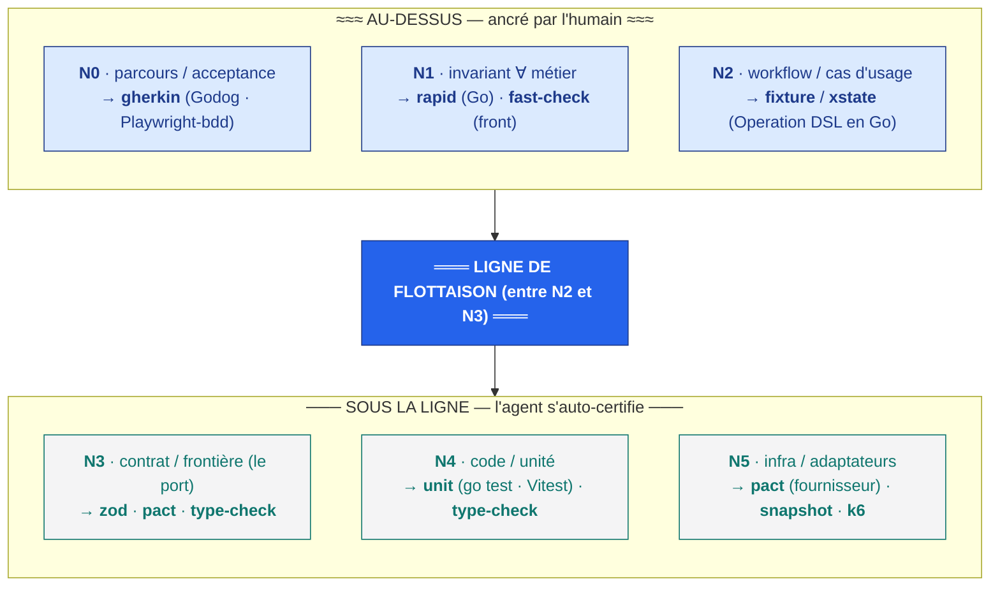
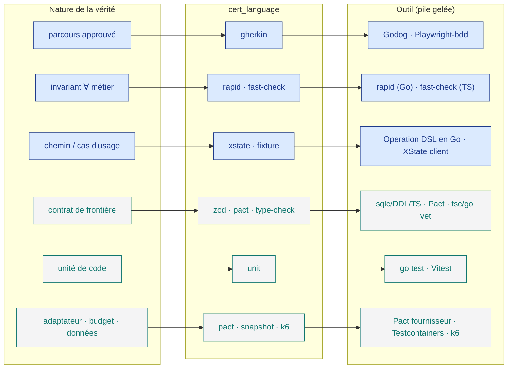

<Note>
Côté concept — aucune ligne de code. Cette page explique *dans quelle langue* une vérité se prouve ; pour la mécanique vue du dedans (le mur, le cliquet, les runners), voyez [la mécanique du mur et du cliquet](/internals/the-wall-and-ratchet).
</Note>

Gherkin n'est qu'un langage de certification parmi beaucoup d'autres. Un miroir (mirror) prouve sa vérité dans une **langue exécutable** précise — son `cert_language` — et **on ne prouve pas une vérité UX comme on prouve un invariant métier**. La nature de la vérité dicte la langue.

C'est l'expansion exacte d'un seul champ du miroir, déjà introduit dans la page [bicéphale : le noyau et son miroir](/concepts/kernel-mirror) : le `cert_language` ∈ `gherkin · xstate · fast-check · zod · pact · type-check · k6` (et, complets ici, `rapid · fixture · snapshot · unit · prose`). Le `test_kind`, la `liveness`, le `reflects`, le monstre, le plan bicéphale sont définis là-bas — cette page-ci ne redéfinit rien de tout cela ; elle déroule **langue par langue** la forme exécutable derrière chaque `test_kind`.

## En une phrase

Un `cert_language` est **la langue exécutable dans laquelle un miroir prouve sa vérité** — et cette langue doit être **déterministe** (même entrée → même sortie). Une vérité a un type épistémique ; son miroir doit être du même type. C'est pourquoi un invariant se prouve par une **propriété** (∀, une région), un chemin par une **fixture** (un point canonique), un contrat inter-cellules par **Pact** (un accord), un parcours par **Gherkin**.

## Le problème que ça résout

« Le test passe » ne veut rien dire si la langue du test n'est pas exécutable et déterministe.

<Columns cols={2}>
<Card title="Le piège" icon="circle-xmark" color="#DC2626">
On confond la *nature* de la vérité et la *langue* qui la prouve. On « teste » un invariant métier avec un exemple (un seul cas, alors que la règle vaut ∀), on « prouve » un parcours avec une assertion unitaire, ou pire : on décrit la vérité en **prose** (« le flux doit rassurer ») et on la croit prouvée. Un miroir non exécutable passe au vert par défaut — il ne prouve rien.
</Card>
<Card title="La règle KRD" icon="circle-check" color="#16A34A">
Une vérité, une langue de son type. KRD §13.4 : *« toute vérité a un type épistémique, et son miroir doit être du même type ».* Un invariant ∀ → une propriété. Un cas d'usage → une fixture. Un contrat → Pact. Un parcours → Gherkin. Et la langue doit être **exécutable comme un test déterministe**, sinon elle ne compte pas dans la loi de complétude (voir le [monstre](/concepts/kernel-mirror)).
</Card>
</Columns>

## Le catalogue complet des `cert_language`

L'enum est **fermé et content-addressed** (la migration le verrouille par un `CHECK`) : `cert_language` ∈ `{gherkin, xstate, fast-check, rapid, zod, pact, type-check, k6, fixture, snapshot, unit, prose}`. Les voici tous, groupés par position vis-à-vis de la **ligne de flottaison** (waterline).

### Au-dessus de la ligne — vérité métier forte, ancrée par l'humain (N0–N2)

| `cert_language` | `test_kind` | Niveau | Outil (pile gelée) | Plan | Ce que ça prouve |
|---|---|---|---|---|---|
| `gherkin` | `acceptance`, `e2e` | **N0** | Godog (back) + Playwright + playwright-bdd (front) | both | Intention / parcours : le parcours utilisateur approuvé est l'oracle exécutable. Ancré par l'humain. |
| `rapid` | `property` | **N1** | rapid (Go) | back | Invariant métier ∀ côté back — vrai sur **tous** les chemins (inclut les miroirs de reproductibilité : même entrée → même sortie). |
| `fast-check` | `property` | **N1** | fast-check (front) | front | Invariant métier ∀ côté front — vrai sur tous les chemins, indépendant du chemin ; un invariant est un ∀, pas un exemple. |
| `xstate` | `fixture` | **N2** | Operation DSL interprété en Go (fixtures `état→commande→events`) ; XState statecharts pour l'état client en Next seulement | both | Workflow / cas d'usage : *ce chemin* produit *ce résultat*, transitions `state→command→events` spécifiques au chemin. |
| `fixture` | `fixture` | **N2** | Operation DSL, fixtures `état→commande→events` interprétées en Go | both | Chemin fonctionnel : épingle **un** point canonique de l'espace de comportement (cette situation exacte → ce résultat exact) ; aussi la fixture d'état d'un control-spec, l'event→effet d'un action-spec, et les fixtures de migration de données sur snapshots de prod. |

### Sous la ligne — déterministe, l'agent s'auto-certifie (N3–N5)

| `cert_language` | `test_kind` | Niveau | Outil (pile gelée) | Plan | Ce que ça prouve |
|---|---|---|---|---|---|
| `zod` | `schema`, `contract` | **N3** | types TS émis depuis l'AST entité source (le schéma consommé équivalent Zod/Pydantic ; source = AST entité en Postgres → sqlc/DDL/TS) | front | Contrat / schéma de frontière : un schéma versionné qui valide la forme au port ; la projection consommée de la **source entité unique**. |
| `pact` | `contract` | **N3**, **N5** | Pact (contrat consommateur entre cellules, N3) + vérification fournisseur Pact + Testcontainers (N5) | both | Contrat inter-cellules (lien horizontal N3) **et** conformité d'adaptateur (N5) — l'adaptateur réel honore le même contrat que le faux (fermeture de la balle traçante). |
| `type-check` | `schema`, `unit` | **N3**, **N4** | Go strict (gofmt/go vet/types stricts) + TS strict (Vitest/tsc) ; un capteur gratuit à chaque diff | both | Forme contrat/code par le système de types (N3/N4) — le typage strict comme capteur déterministe gratuit ; les structs Go / types TS émis depuis la source unique. |
| `unit` | `unit` | **N4** | go test (back) + Vitest (front) | both | Code / unité : une signature locale + un exemple TDD ; l'agent s'auto-certifie sous la ligne (computationnel). |
| `snapshot` | `snapshot` | **N5** | fixtures de migration sur snapshots de prod + expand-contract (le seul golden-master légitime, transverse données/migration) | db | Golden-master données / migration (transverse) — épingle une forme de données connue à travers une migration expand-contract ; le seul endroit où le golden-master est légitime. |
| `k6` | `meter` | **N5** | k6 (+ Semgrep · gosec · gitleaks pour les budgets) | both | Budget / SLO (transverse perf-sécurité) — un seuil mesurable (latence p99, débit) vérifié comme un **meter** contre un SLO déclaré. |

### Hors-jeu de la complétude — non exécutable

| `cert_language` | `test_kind` | Niveau | Outil | Plan | Ce que ça prouve |
|---|---|---|---|---|---|
| `prose` | tous (`acceptance`…`meter`) | — | aucun — revue humaine / LLM-juge seulement ; **PAS** un capteur déterministe | both | Certification **non exécutable** (KRD §805) : prose ou LLM-juge seul. Pour la vérité UX/inférentielle validée par revue humaine, accessibilité, heuristique ou A/B — elle **ne compte pas** dans la loi de complétude ; une couche dont le seul miroir est `prose` reste un **monstre** `no_truth_without_mirror` (ROUGE). |

## Le langage suit la nature de la vérité

Les six niveaux N0–N5 (détaillés dans [les niveaux de preuve](/concepts/proof-levels)) ne sont pas un classement de difficulté : ce sont six **natures de vérité**, et chaque nature appelle sa langue. La ligne de flottaison passe **entre N2 et N3** — au-dessus, l'humain ancre le sens ; en dessous, l'agent s'auto-certifie sur le computationnel.

<Note>
**Au-dessus = test-as-goal, ancré par l'humain.** N0/N1/N2 (gherkin, property, fixture) sont au-dessus de la ligne : l'agent **ne peut pas** se déclarer vert sur le *sens* (le danger circulaire). **Sous la ligne = test-as-means, déterministe** : N3/N4/N5 (zod/type-check, unit, pact) sont auto-certifiés par l'agent. Voir [qui certifie quoi](/concepts/proof-levels) pour la frontière des permissions.
</Note>

### Le détail langue par langue

<AccordionGroup>
<Accordion title="gherkin — le parcours (N0)" icon="route">
Le `.feature` écrit en langage ubiquitaire (DDD) : les mêmes mots en Go et en Next. `Scenario: a logged-in user checks out a non-empty cart Then the order is placed`. Exécuté par **Godog** côté back, **Playwright + playwright-bdd** côté front. C'est l'oracle d'acceptation : un humain l'approuve, l'agent ne s'y déclare jamais vert seul.
</Accordion>
<Accordion title="rapid · fast-check — l'invariant ∀ (N1)" icon="infinity">
Un invariant est un **∀** : vrai sur *tous* les chemins, indépendant du chemin. On le prouve par une **propriété**, jamais par un exemple. `rapid.Check: ComputeCompleteness(m,l)==ComputeCompleteness(m,l)` (Go) ; `fc.assert(fc.property(arbCart, c => total(c) >= 0))` (front). Inclut les **miroirs de reproductibilité** : même entrée → même sortie, le filet déterministe de chaque fonction pure.
</Accordion>
<Accordion title="xstate · fixture — le workflow (N2)" icon="diagram-project">
Un cas d'usage épingle **un** point canonique de l'espace de comportement : *cette* situation exacte → *ce* résultat exact, jamais un ∀. `state Draft --submit--> Pending emits OrderSubmitted` ; `given cart {items:[x]}, form.valid → button.enabled == true`. La vérité du workflow est la fixture `état→commande→events` interprétée par l'Operation DSL en Go ; XState reste **client-only** en Next. La même langue épingle aussi l'état d'un control-spec et l'event→effet d'un action-spec.
</Accordion>
<Accordion title="zod · type-check — le contrat de forme (N3/N4)" icon="layer-group">
`zod` valide la forme au port : `OrderSchema.parse(payload)` rejette un `total` manquant — c'est la projection consommée de la **source entité unique** (AST en Postgres → sqlc/DDL/TS). `type-check` est le typage strict comme **capteur gratuit** à chaque diff : `tsc --noEmit` échoue quand un champ dérive. Aucun double-typage : une source, N projections.
</Accordion>
<Accordion title="pact — le contrat inter-cellules (N3) et l'adaptateur (N5)" icon="plug">
`pact` prouve deux choses. En N3 (lien horizontal) : la cellule-A consomme le contrat-B@v. En N5 : le **fournisseur** vérifie que l'adaptateur réel honore le *même* contrat que le faux — la fermeture de la balle traçante (tracer-bullet), avec Testcontainers et un vrai Postgres.
</Accordion>
<Accordion title="unit · snapshot · k6 — code, données, budget" icon="vial">
`unit` (`go test`, Vitest) : une signature locale + un exemple TDD, sous la ligne, auto-certifié. `snapshot` : le **seul** golden-master légitime — une forme de données connue qui survit à une migration expand-contract sur snapshot de prod. `k6` : un **meter**, seuil mesurable contre un SLO déclaré (`p99 latency < 200ms over 1k VUs`), avec Semgrep · gosec · gitleaks pour les budgets de sécurité.
</Accordion>
<Accordion title="prose — la certification non exécutable" icon="circle-xmark">
`prose` couvre n'importe quel `test_kind`, mais n'a **aucun** niveau de preuve : c'est de la revue humaine ou un LLM-juge seul. Indispensable pour la vérité UX/inférentielle (« le flux doit rassurer »), l'accessibilité, l'heuristique, l'A/B — mais elle **ne compte jamais** au vert dans la loi de complétude. `CertProse.IsExecutable()==false` (prouvé par `TestIsExecutable`, `TestNonExecutableNeverCounts`).
</Accordion>
</AccordionGroup>

## La règle d'or : exécutable et déterministe

<Warning>
**Un `cert_language` doit être exécutable comme un test déterministe — même entrée, même sortie.** C'est la règle qui ferme la boucle (KRD §805). Un miroir dont le `cert_language` n'est *pas* un capteur déterministe — la `prose` seule, ou un **LLM-juge** seul — **ne compte pas** dans la loi de complétude.

`records.go` encode ça dans `executableCertLang{}` : les **12** valeurs de l'enum sont exécutables **sauf** `prose`. Conséquence dure, prouvée par `TestNoTruthWithoutMirror_NonExecutableDoesNotCount` : **une couche dont le seul miroir est `prose` reste un monstre** `no_truth_without_mirror` → verdict `RED_MONSTER`, quelle que soit la `liveness` déclarée. Un LLM-juge ne sera jamais une langue de certification au-dessus de la ligne : le danger circulaire (l'agent qui se note lui-même) est exactement ce que le mur interdit. La distinction capteur **computationnel** (déterministe) vs **inférentiel** (LLM) est détaillée dans [les niveaux de preuve](/concepts/proof-levels).
</Warning>

## Une couche, plusieurs miroirs

Le `reflects` est un lien **un-à-plusieurs**, pas un 1↔1 (KRD §33). Une seule couche de spec peut porter **plusieurs** miroirs à la fois — et donc plusieurs `cert_language`.

Une `operation`, par exemple, peut exiger en même temps :
- une **fixture** (`xstate`/`fixture`, N2) qui épingle son chemin canonique `état→commande→events` ;
- un **contrat** (`pact`, N3) sur sa frontière inter-cellules ;
- une **propriété** (`rapid`/`fast-check`, N1) sur les `policy` qu'elle invoque.

La loi de complétude est donc double : **au moins un miroir vivant par couche, ET chaque `test_kind` requis par la nature de la couche est présent** — lu dans le profil §90 enregistré (`RequiredTestKinds`), jamais inventé. Sinon vous croyez avoir la symétrie mais vous avez un trou : la fixture existe, la propriété manque, l'invariant n'est jamais vérifié ∀. (Le `test_kind`, la `liveness` et le monstre sont définis dans [bicéphale](/concepts/kernel-mirror).)

## Les capacités formelles (rares)

L'épine pragmatique — `gherkin` / `rapid` / `fast-check` / `xstate` / `fixture` / `zod` / `pact` / `unit` — est la **colonne** : capteurs déterministes exécutables, pilotables par le LLM, curables par l'humain. À côté, KRD prévoit une **capacité formelle** : un *cap* chirurgical, entré **seulement quand une violation est catastrophique ∧ l'espace dépasse l'échantillonnage** (argent, auth, RGPD). Elle vit **au-dessus de la ligne** comme oracle de conception encodé en miroir à passer — le LLM la respecte, ne la pilote jamais.

<Columns cols={2}>
<Card title="z3 — SMT (N1, données catastrophiques)" icon="shield-halved" color="#71717A">
Cap N1, réutilisé pour les invariants de **données** catastrophiques (transverse/migration). Seulement quand la violation est catastrophique ET que l'espace dépasse l'échantillonnage.
</Card>
<Card title="tla+ — parcours concurrent (N0)" icon="route" color="#71717A">
Cap N0 quand le parcours est distribué/concurrent. Aussi une option de miroir de la grammaire de fitness (`statechart | pact | tla+`). Chirurgical, au-dessus de la ligne.
</Card>
<Card title="dafny — fonction pure critique (N4)" icon="code" color="#71717A">
Cap N4 pour la rare fonction pure critique (crypto, arithmétique monétaire, un parseur). Catastrophique ∧ non-échantillonnable seulement.
</Card>
<Card title="alloy · uppaal — structure & temps réel" icon="gears" color="#71717A">
`alloy` (cap N3) : un invariant structurel du graphe inexprimable par les types. `uppaal` (budgets transverse) : automates temporisés, hard real-time seulement — le coût le plus élevé, la promotion la plus rare.
</Card>
</Columns>

<Note>
**N5 n'a pas de formel.** Le monde extérieur n'est pas *prouvé*, il est *testé* (`pact` fournisseur, `snapshot`, `k6`). Le formel reste un cap au-dessus de la ligne, jamais piloté par le LLM.
</Note>

## De la nature de la vérité à l'outil

<Tip>
La phrase à retenir : **la nature de la vérité choisit la langue, et la langue doit être exécutable.** Un invariant n'est pas un exemple, un parcours n'est pas une assertion unitaire, et la prose ne prouve rien — elle documente.
</Tip>

## `cert_language` vs DSL source

Attention à ne pas confondre deux plans. Les DSL de la famille `expr` / `policy` / `operation` / `control` / `action` (détaillés dans [couches et verticale](/concepts/layers-and-vertical)) vivent sur le **plan spec / source** : ils décrivent *ce qui doit être vrai* (la tête d'intention du noyau). Les `cert_language` (`gherkin`, `rapid`, `fast-check`, `xstate`, `pact`, `zod`, `k6`…) vivent sur le **plan miroir** : la preuve *exécutable* de cette vérité (la tête de preuve). Une `operation` est une source ; sa `fixture` est le miroir qui la prouve. Le noyau stocke le comportement comme AST en Postgres (la source) mais l'exécution réutilise des libs mûres — c'est le plan miroir qui porte les `cert_language`.

## Où ça en est dans AIDOS

<Note>
**État d'implémentation (honnête).** Le record `Mirror` (avec son champ `cert_language`) existe depuis <Badge color="blue">S02</Badge>. Le schéma `mirrors` en Postgres + la `liveness` arrivent en <Badge color="green">S06</Badge>. Les cert-runners câblés *aujourd'hui* couvrent **N0** (`gherkin` via Godog) et **N1** (property tests, `rapid` / `fast-check`). Les autres `cert_language` — fixtures `xstate`, `pact`, `k6`, `snapshot`… — arrivent **au fil du cliquet** <Badge color="orange">à venir</Badge>. L'enum, lui, est déjà fermé et verrouillé par un `CHECK` de migration ; le paquet de complétude est **pur** (lit `mirrors ⋈ kernel`, n'écrit rien) et déterministe (miroir de reproductibilité).
</Note>

## En résumé

<Steps>
<Step title="Une langue par nature de vérité" icon="shuffle">
`gherkin` pour un parcours, `rapid`/`fast-check` pour un invariant ∀, `xstate`/`fixture` pour un workflow, `zod`/`pact`/`type-check` pour un contrat, `unit` pour le code, `snapshot`/`k6` pour données et budgets.
</Step>
<Step title="Toujours exécutable et déterministe" icon="bolt">
Même entrée → même sortie. La `prose` (et le LLM-juge seul) documentent mais **ne comptent pas** : leur seul miroir = un monstre.
</Step>
<Step title="Une couche peut porter plusieurs miroirs" icon="layer-group">
Complétude = au moins un miroir vivant par couche ET chaque `test_kind` requis présent (profil §90, jamais inventé).
</Step>
<Step title="Le formel reste un cap rare" icon="shield-halved">
`z3` / `tla+` / `dafny` / `alloy` / `uppaal` : seulement quand catastrophique ∧ non-échantillonnable, au-dessus de la ligne, jamais piloté par le LLM.
</Step>
</Steps>

## Pour aller plus loin

<CardGroup cols={3}>
<Card title="Les niveaux de preuve" icon="layer-group" href="/concepts/proof-levels">
L'échelle N0–N5, capteur computationnel vs inférentiel, et qui certifie de part et d'autre de la ligne de flottaison.
</Card>
<Card title="Bicéphale : noyau et miroir" icon="infinity" href="/concepts/kernel-mirror">
La page parente : le champ `cert_language` dans le record `Mirror`, le `test_kind`, la `liveness`, le monstre et le plan bicéphale.
</Card>
<Card title="Comportement et versionnement" icon="code-branch" href="/concepts/behavior-and-versioning">
Le lien `mirrors`, la vague de rouge qui part du miroir épinglé par hash, append-only et content-addressed.
</Card>
<Card title="Couches et verticale" icon="diagram-project" href="/concepts/layers-and-vertical">
La famille de DSL `expr`/`policy`/`operation`/`control`/`action` côté source — à ne pas confondre avec les `cert_language` côté miroir.
</Card>
<Card title="La pile gelée" icon="server" href="/internals/the-stack">
Les outils figés derrière chaque langage : Godog, rapid, fast-check, sqlc, Pact, Testcontainers, k6.
</Card>
<Card title="Le mur et le cliquet" icon="shield-halved" href="/internals/the-wall-and-ratchet">
La mécanique vue du dedans : pourquoi l'agent ne peut pas écrire la vérité ni se déclarer vert sur le sens.
</Card>
</CardGroup>