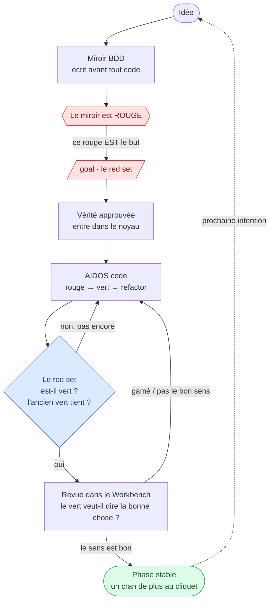
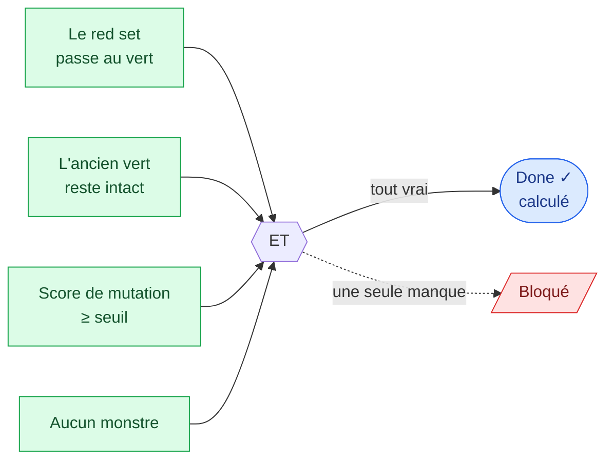
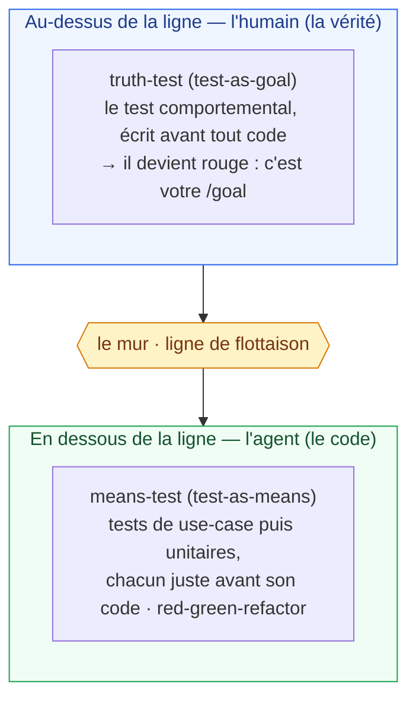

<Note>
  Côté concept — aucune ligne de code. Ce que décrit cette page est la **méthode KRD**, vraie quelle que soit l'implémentation. Pour le cycle pas à pas tel que vous le jouez dans AIDOS, voir [Développer votre app → Le workflow KRD](/guide/krd-workflow). Pour la mécanique du noyau et de son miroir, voir [Le noyau et le miroir](/concepts/kernel-mirror).
</Note>

## En une phrase

En KRD, **le test rouge EST le goal**. Vous ne décrivez pas votre intention en prose puis ne lâchez l'IA dessus en espérant qu'elle « se sente prête » : vous écrivez d'abord la **preuve exécutable** de ce que vous voulez — un **miroir** (mirror) qui, faute de code, est **rouge** — et ce rouge devient à la fois la cible et le signal d'arrivée. AIDOS code librement jusqu'à le faire passer au **vert** sans casser un seul vert existant. À ce moment-là, et seulement là, le but est **calculé** atteint — jamais déclaré.

## Le problème que ça résout

Quand on confie une tâche longue à un agent, deux choses tournent mal :

<Columns cols={2}>
  <Card title="L'agent note sa propre copie" icon="circle-question">
    Sans cible exécutable, un `/goal` s'arrête « quand l'agent *pense* avoir fini ». C'est exactement la circularité que KRD existe pour fermer : celui qui code est aussi celui qui décide si c'est bon.
  </Card>
  <Card title="L'agent vagabonde" icon="route">
    Sans but précis, il sous-tire (il en fait trop peu) ou il sur-ingénierie et part en vrille (le *context drift*). Le périmètre n'est borné par rien.
  </Card>
</Columns>

KRD résout les deux d'un seul geste. Le **set rouge** du noyau — l'ensemble des miroirs qui doivent passer au vert — donne :

1. un **objectif précis** (ce rouge-là, pas un autre) ;
2. une **condition d'arrêt précise et non-gameable** (le rouge passe au vert, déterministe, mesuré par machine — pas d'auto-évaluation) ;
3. une **protection anti-scope-creep** (l'agent ne peut pas vagabonder : le `/goal` *est* le set rouge, rien d'autre).

<Tip>
  Un goal exprimé autrement que comme un test rouge n'est qu'un **vœu** — et un vœu en prose, c'est le piège des méthodes pilotées par la spec : la prose dérive du code et on ne sait plus les réconcilier. Le test-first n'est pas une étape *avant* le goal ; c'est le goal sous sa **seule forme exécutable**.
</Tip>

## Le cycle complet, du point de vue de votre app

Voici le parcours d'une fonctionnalité, de l'intention à la phase stable. C'est la **règle unique** de KRD en action : on ne part jamais du code, on déplace un cran du noyau et on laisse l'IA ramener le code au vert sous la contrainte.



<Steps>
  <Step title="Idée" icon="lightbulb">
    Une intention, un candidat-vérité — pas encore gelé, pas encore prouvé. Vous voulez « qu'un visiteur anonyme ne voie jamais de contenu privé », par exemple.
  </Step>
  <Step title="Miroir BDD (rouge)" icon="vial">
    Vous écrivez la **preuve exécutable** de cette intention *avant* tout code, sous forme *Given / When / Then* (ou un invariant ∀, ou une fixture *état → commande → événements* selon la nature de la vérité). Faute de code en face, ce miroir échoue : il est **rouge**.
  </Step>
  <Step title="/goal — le red set" icon="bullseye">
    Ce rouge **est** votre `/goal`. Il définit précisément ce que « atteindre le but » veut dire, et il signalera (en passant au vert) quand vous y êtes. Le set rouge **est** la todo-list.
  </Step>
  <Step title="AIDOS code (rouge → vert → refactor)" icon="robot">
    L'agent écrit le code, librement, en partant du rouge le plus externe et en descendant tranche par tranche. `rouge → vert → refactor`, à chaque diff. Il a zéro liberté sur *ce qui est vrai*, liberté totale sur *comment c'est fait*.
  </Step>
  <Step title="Revue dans le Workbench" icon="user-check">
    Le vert *computational* est nécessaire mais pas suffisant. Vous (l'humain, l'ancre) vérifiez dans le Workbench que le vert **veut dire la bonne chose** et que l'agent n'a pas *gamé* la fixture pour la satisfaire de travers.
  </Step>
  <Step title="Phase stable" icon="anchor">
    Une coupe cohérente où tout est vert. C'est un **cran de plus au cliquet** (ratchet), et le point de départ de l'intention suivante. Rien de ce qui était vert ne casse silencieusement.
  </Step>
</Steps>

<Note>
  À venir (S29) — Le **goal engine** qui transforme automatiquement une idée en `Truth + Mirror` (changeset DRAFT) et calcule le set rouge avec sa condition d'arrêt non-gameable est l'étape S29 d'AIDOS. Le **cycle ci-dessus est la méthode** — vrai dès maintenant — et il est déjà partiellement outillé (les miroirs et leurs cert-runners existent depuis S06 ; le mur depuis S04). Le moteur `/goal` complet arrive avec S29.
</Note>

## « Done est calculé, jamais déclaré »

C'est le cœur de l'affaire. Dans AIDOS, vous ne pouvez **pas** dire « c'est fini ». « Fini » est le résultat d'un calcul déterministe, et tant que ce calcul n'est pas satisfait, le harnais bloque.



Pourquoi c'est essentiel : le danger numéro un d'un système qui s'auto-améliore est qu'il **note sa propre copie**. KRD ferme cette porte en plaçant le juge — le miroir et la réalité — **au-dessus du mur** (wall), hors de portée de l'agent. L'agent peut tout refactorer, tout optimiser, tout réécrire ; il ne peut pas bouger le mètre-étalon. Un second agent qui validerait le premier réduit la corvée, mais **ce n'est pas une preuve** : le juge reste déterministe.

Le mariage qui rend tout ça opérationnel :

| Brique | Ce qu'elle apporte | D'où elle vient |
|---|---|---|
| la commande `/goal` | le moteur de boucle bornée (travail autonome sur plusieurs tours) | le harnais |
| le noyau `rouge → vert` | la **condition de succès non-circulaire** | KRD |
| les budgets temps / tours / tokens | le garde-fou anti-run-fou | le harnais |
| la durabilité (pause / resume) | la réconciliation longue d'une vague de rouge | le harnais |

## Les deux test-first, de part et d'autre du mur

Il y a deux écritures de test dans le cycle, séparées par le **mur**, et il ne faut jamais les confondre.



<Columns cols={2}>
  <Card title="truth-test — l'humain, au-dessus" icon="user">
    Le **test-first macro**. Quand vous posez un nouveau cran de noyau (une fixture, un invariant), vous écrivez le test comportemental *avant* qu'aucun code n'existe. Il devient rouge : c'est ça, votre `/goal`.
  </Card>
  <Card title="means-test — l'agent, en dessous" icon="robot">
    Le **test-first micro**. En descendant outside-in, l'agent écrit le test de use-case puis le test unitaire, chacun juste avant son code. C'est le `red → green → refactor` classique, comme des sous-buts vers le rouge humain.
  </Card>
</Columns>

<Warning>
  Le garde-fou crucial : l'agent a le droit d'écrire des **means-tests** (des sous-buts vers le rouge que vous avez posé). Il n'a **jamais** le droit d'écrire des **truth-tests** — de nouveaux invariants qu'il satisferait ensuite. C'est exactement la circularité (s'auto-noter) que le mur interdit.
</Warning>

La triade complète tient en une ligne :

> Le **noyau** = l'état (ce qui est vrai maintenant) · le **`/goal`** = la direction (le delta rouge à refermer) · le **TDD** = le mouvement (`rouge → vert → refactor` qui referme le rouge).

## La règle unique

C'est la phrase à retenir de tout ce livre :

> **On n'implémente jamais en partant du code ni d'une spec — on déplace un cran du noyau, puis on laisse l'agent ramener le code au vert sous la contrainte.** L'humain bouge le cliquet ; l'agent rattrape ; le harnais arbitre.

Et le piège de séquencement à ne jamais oublier : la **phase noyau** (vous éditez ce qui doit être vrai — lent, humain, au-dessus de la ligne) et la **phase code** (l'agent réconcilie le code — rapide, libre, en dessous) sont **deux mouvements dans deux zones, dans cet ordre**. Si l'agent touche le noyau dans le même geste où il code, le mur tombe et vous êtes revenu au vibe coding.

<AccordionGroup>
  <Accordion title="Le cas qui fait toute la différence — modifier l'existant" icon="rotate">
    Vous éditez une vérité du noyau : son hash change, et *tous les consommateurs de l'ancien hash virent au rouge automatiquement*. Cette **vague de rouge** (RedWave) n'est pas une panne — c'est votre worklist, l'ensemble exact de ce qui reste à réconcilier. L'agent réconcilie ; les fixtures inchangées tiennent. Le vieux problème « les facts changent » est résolu mécaniquement.
  </Accordion>
  <Accordion title="L'exemple déroulé — accueil → connexion → page protégée → la règle change" icon="list-check">
    En quatre itérations, chacune = un delta de noyau (vous) + une réconciliation (l'IA) :

    1. **Accueil** — fixture « anonyme → accueil, rien de privé » + invariant `INV-AUTH-001` ; l'IA code jusqu'au vert. Premier cran posé.
    2. **Connexion** — fixtures login OK/KO + invariant « jamais de session sans creds, mot de passe jamais loggé » + contrat ; l'IA code contre un faux adaptateur.
    3. **Page protégée** — l'agent oublie le garde → l'invariant `INV-AUTH-001` vire au **rouge**. La régression est bloquée *avant* le merge. C'est le cœur de la démonstration.
    4. **La règle change** — vous ajoutez « 3 échecs → blocage 15 min » ; le hash de la politique change → **vague de rouge** ciblée sur les consommateurs, les login OK/KO tiennent.

    Le jour où vous voyez ce rouge tomber au bon endroit (itération 3), le concept est validé. Tant que vous ne l'avez pas vu, c'est encore de la théorie.
  </Accordion>
</AccordionGroup>

## Exemple minimal : `pour i de 0 à 10 : afficher(i)`

Prenons le plus petit programme imaginable — une boucle qui affiche 0 à 10. Voici ce qu'AIDOS en fait, de bout en bout, **sans jamais partir du prompt vers le code** :

<Steps>
  <Step title="1 · L'intention (humain)">
    « Quand le programme tourne, il affiche les entiers de 0 à 10, un par ligne. »
  </Step>
  <Step title="2 · Le miroir BDD — rouge d'abord">
    On écrit la **preuve avant le code** — une fixture `état → commande → events` (niveau N2, workflow) :

    ```gherkin
    Scénario: la boucle affiche 0 à 10
      Étant donné une sortie vide
      Quand j'exécute « pour i de 0 à 10 : afficher(i) »
      Alors la sortie est exactement les lignes 0,1,2,3,4,5,6,7,8,9,10
    ```

    Faute de code, ce miroir est **rouge**. Ce rouge **est** le `/goal`.
  </Step>
  <Step title="3 · AIDOS code jusqu'au vert">
    L'agent écrit l'implémentation (une **projection**, jamais la vérité) :

    ```go
    for i := 0; i <= 10; i++ {
        fmt.Println(i)
    }
    ```

    … et itère jusqu'à faire passer la fixture au **vert**, sans casser un seul vert existant.
  </Step>
  <Step title="4 · Vert calculé → phase stable">
    La sortie observée = `0…10` → le miroir est vert. « Done » est **calculé**, jamais déclaré. Le **cliquet** pose un cran : cette boucle ne pourra plus régresser.
  </Step>
</Steps>

<Note>
  Le détail qui dit tout KRD en une ligne : **la borne**. Le miroir épingle « 0 à 10 » = **onze** lignes (0…10 inclus). Si l'agent écrit `i < 10` (dix lignes), le miroir reste **rouge** — l'erreur de borne est attrapée par la **preuve**, pas par une relecture humaine. La borne est une **vérité** (humaine, au-dessus du mur) ; le `for` n'en est qu'une **projection vérifiée** (IA, en-dessous).
</Note>

## Pour aller plus loin

<Columns cols={2}>
  <Card title="Le workflow KRD pas à pas" icon="diagram-project" href="/guide/krd-workflow">
    Le même cycle, mais tel que vous le jouez concrètement dans AIDOS — les gestes, les écrans, l'ordre des commits.
  </Card>
  <Card title="Les niveaux de preuve N0 à N5" icon="layer-group" href="/concepts/proof-levels">
    Quelle forme de miroir prouve quelle nature de vérité — du parcours d'acceptation à l'unité.
  </Card>
  <Card title="Le noyau et le miroir" icon="database" href="/concepts/kernel-mirror">
    Pourquoi la vérité et sa preuve sont bicéphales et inséparables, co-versionnées.
  </Card>
  <Card title="La méthode KRD" icon="ratchet" href="/concepts/krd-method">
    Les deux mandats, le cliquet, le mur — la vue d'ensemble de la discipline.
  </Card>
</Columns>
