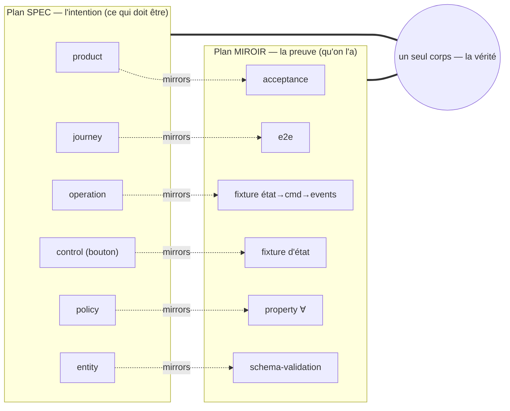
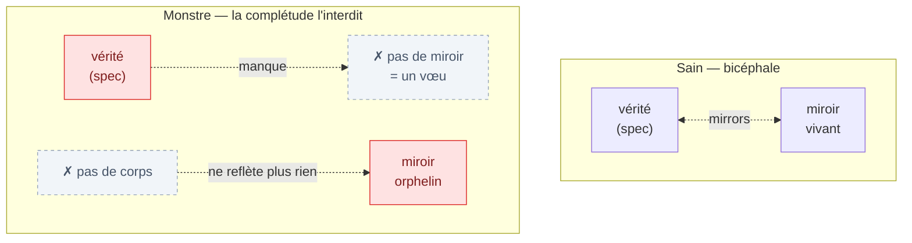
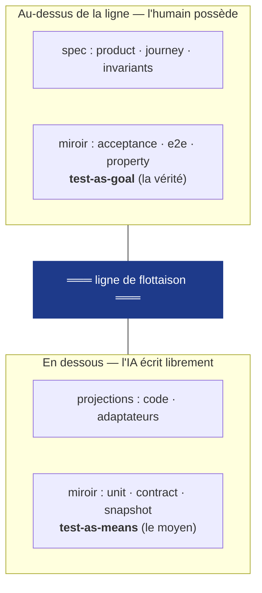
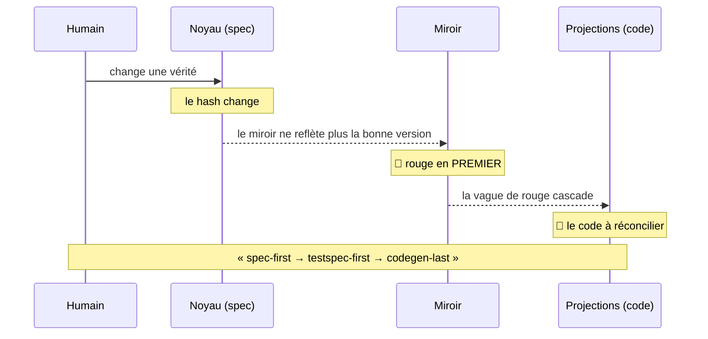

<Note>
  Côté concept — aucune ligne de code. Pour la mécanique vue du dedans (le mur, le cliquet, la complétude), voir [Pour moi → Le mur et le cliquet](/internals/the-wall-and-ratchet).
</Note>

## En une phrase

Dans AIDOS, une vérité ne vit jamais seule. Elle a toujours **deux têtes** sur un seul corps : le **noyau** (kernel) dit *ce qui doit être vrai* — l'intention ; le **miroir** (mirror) prouve *qu'on l'a* — la preuve exécutable. Les deux sont inséparables, versionnés ensemble, et reliés par un lien dédié, `mirrors`. C'est ce qu'on appelle le plan **bicéphale**.

<Tip>
  Le mot importe. *Bicaméral* (deux chambres) suggérerait deux maisons symétriques et **séparables** — un parlement à deux chambres, où chacune peut légiférer seule. Ici, ce n'est pas le cas : une tête ne vit pas détachée de son corps. On dit donc **bicéphale** — un corps, deux têtes.
</Tip>

## Le problème que ça résout

La tentation naturelle, quand on veut prouver une vérité, c'est de coller un champ `test` à côté d'elle. « Voici la règle, et voici son test. » C'est exactement ce qu'AIDOS **refuse** de faire — et pour une bonne raison.

Un test rangé comme un simple attribut devient **subordonné, décoratif, et invisible quand il casse**. Il n'a pas d'identité propre, pas de version propre, pas de liens propres. Le jour où il cesse de prouver quoi que ce soit — parce qu'il a été désactivé, parce qu'il ne reflète plus la bonne version de la règle — rien ne le signale. Le test passe au vert *par défaut*, et vous croyez avoir une preuve alors que vous avez un cadavre.

La réponse de KRD : **le test n'est pas à côté de la vérité, il en est la forme exécutable.** Et pour qu'il puisse *casser tout seul* — ce qu'on veut absolument —, il doit être une **couche à part entière**, sur son propre plan, avec sa propre identité.

<Columns cols={2}>
  <Card title="L'attribut test — le piège" icon="circle-xmark">
    Un champ `test` accroché à la vérité. Pas d'identité, pas de version. Quand il meurt, personne ne le voit : il passe au vert par défaut. Une preuve fantôme.
  </Card>
  <Card title="Le plan miroir — la solution" icon="circle-check">
    Le test devient une **couche pleine**, sur un plan parallèle. Sa propre identité, sa propre version, ses propres liens. Il peut casser indépendamment — donc on sait quand il ment.
  </Card>
</Columns>

## Un corps, deux têtes

Imaginez deux plans qui se font face. À gauche, le **plan spec** : la vérité, ce qui *doit être*. À droite, le **plan miroir** : la preuve, qu'on *l'a bien*. Chaque élément de gauche se reflète dans un élément de droite, et le lien qui les joint s'appelle `mirrors`.



Les deux plans ne sont **ni symétriques ni séparables** :

- un **miroir orphelin est rouge** — un miroir ne *vit* pas sans son corps (sa spec) ;
- une **spec sans miroir n'est pas une vérité** — c'est un vœu.

Une chambre de parlement peut légiférer seule ; une tête ne peut pas vivre détachée du corps. C'est toute la nuance que capte le mot *bicéphale* : la **non-indépendance** des deux têtes. Spec et miroir doivent pointer dans la même direction, ou la créature est malade.

## `mirrors`, le sixième lien

AIDOS relie ses vérités entre elles par un petit jeu de liens typés — une vérité se projette vers du code (`projects_to`), dérive d'une autre (`derives_from`), contracte une frontière (`contracts_with`), déclenche une action (`triggers`), lie un bouton à une opération (`binds`). À ceux-là s'ajoute **`mirrors`** : le lien qui attache une vérité à sa preuve.

Comme tous les autres, il est **pinné sur la version** : un miroir ne reflète pas « la règle » en général, il reflète *cette version-là* de la règle (identifiée par son hash). C'est ce détail qui rend la vague de rouge possible (voir plus bas).

## La loi de complétude — « pas de monstre »

C'est la règle qui rend tout l'édifice honnête. AIDOS la vérifie **mécaniquement**, à chaque étape.

> **Toute couche du plan spec a au moins un miroir vivant, exécutable comme un test déterministe. Une couche spec sans miroir, ou un miroir orphelin qui ne reflète plus rien, ou un miroir dont le langage n'est pas exécutable → rouge.**

Cet échec a un nom : le **monstre**.

> **Le monstre** = un corps à qui il manque une tête, ou une tête sans corps — c'est-à-dire une **spec sans miroir**, ou un **miroir orphelin**. Précisément ce que la loi de complétude interdit.



Pourquoi un plan plutôt qu'un attribut ? Parce qu'un plan attrape les **détecteurs morts**. Un miroir qui « passe » mais qui ne peut plus jamais échouer n'est pas une preuve — c'est un monstre déguisé en vert. AIDOS le démasque par l'**injection de faute** : on casse exprès la source, et on vérifie que le miroir *vire au rouge*. Une tête-preuve qui ne réagit pas est morte ; le corps est un monstre.

<Note>
  État d'implémentation. Le **schéma `mirrors`** et le calcul du caractère vivant (*liveness*) sont en place (S06) ; la **loi de complétude et la détection du monstre** (un hook qui bloque à la fin d'une étape) sont en place (S12). L'enregistrement `Mirror` lui-même existe depuis S02.
</Note>

## Le miroir a sa propre ligne de flottaison

AIDOS trace une **ligne de flottaison** (waterline) qui sépare ce que l'humain possède de ce que l'IA peut écrire. La nuance bicéphale, c'est que cette ligne traverse **les deux têtes en même temps**.



- **Au-dessus** (acceptance, e2e, property) : le miroir est *écrit par l'humain*. C'est le **test-as-goal** — la vérité elle-même.
- **En dessous** (unit, contract, snapshot) : le miroir est *écrit par l'IA*. C'est le **test-as-means** — un simple moyen d'atteindre le but.

L'IA peut tout refactorer en dessous ; elle ne touche jamais au mètre-étalon au-dessus.

## La vague de rouge part toujours du miroir

Parce que le lien `mirrors` est pinné sur la version, le miroir est **le premier témoin** de tout changement. Vous modifiez une vérité → son hash change → **son miroir vire au rouge en premier** (il ne reflète plus la bonne version) → *puis* les projections cascadent.



Cette vague de rouge — le **RedWave** — n'est pas une panne : c'est votre liste de travail, l'ensemble exact de ce qui reste à ramener au vert. Le miroir se met à jour *avant* que le code bouge.

<Note>
  État d'implémentation. Le calcul complet du rayon d'impact et sa cascade dépendent du DAG de versions et du moteur de changesets — **à venir** (S20, S24). La forme du miroir versionné existe déjà (S02, S06).
</Note>

## Le reflet est un-vers-plusieurs

Une dernière nuance, honnête : le reflet n'est pas toujours `1 ↔ 1`. Une même couche spec peut avoir **plusieurs** miroirs.

<AccordionGroup>
  <Accordion title="Une operation, par exemple, a souvent trois miroirs" icon="diagram-project">
    Une fixture *état → commande → événements* qui prouve son comportement, **plus** un contrat (Pact) sur sa frontière, **plus** des property tests sur ses policies. Trois preuves de natures différentes pour une seule vérité.
  </Accordion>
  <Accordion title="La loi de complétude devient donc plus fine" icon="list-check">
    Non seulement **au moins un miroir vivant par couche**, mais aussi **chaque `test_kind` requis par la nature de la couche est présent**. Sinon vous croyez avoir une symétrie et vous avez un trou — typiquement : la fixture existe, mais le property test manque, et l'invariant n'est jamais vérifié ∀.
  </Accordion>
</AccordionGroup>

## L'enregistrement `Mirror`

Chaque miroir porte quelques champs typés — ce sont eux qui le rendent *gouvernable* plutôt que décoratif :

<ResponseField name="reflects" type="lien @version">
  La couche spec reflétée, pinnée sur sa version (le lien `mirrors`).
</ResponseField>

<ResponseField name="test_kind" type="enum">
  La nature de la preuve : `acceptance` · `e2e` · `property` · `fixture` · `contract` · `schema` · `unit` · `snapshot` · `meter`.
</ResponseField>

<ResponseField name="cert_language" type="enum">
  Le langage de certification, qui doit être **exécutable comme un test déterministe** : `gherkin` · `xstate` · `fast-check` · `zod` · `pact` · `type-check` · `k6`…
</ResponseField>

<ResponseField name="authority" type="above | below">
  De quel côté de la ligne de flottaison vit le miroir : `above` (humain, test-as-goal) ou `below` (IA, test-as-means).
</ResponseField>

<ResponseField name="liveness" type="vivant | mort">
  Le caractère vivant. Un miroir non exécutable ou orphelin est **mort** — donc rouge, donc un monstre.
</ResponseField>

## Le bouton, sur ses deux plans

Pour rendre tout cela concret : même un bouton vit en double. À gauche, le bouton comme **vérité** ; à droite, le bouton comme **preuve**.

<CodeGroup>

```text Plan SPEC — la vérité
control "checkout-button" {
  view: "cart"
  visible_when: $.cart.items.length > 0
  enabled_when: $.form.valid && !$.submitting
  triggers: action "checkout-submit"
}
```

```text Plan MIROIR — la preuve (cert_language: fixture, authority: above)
mirror reflects "checkout-button" {
  given { cart: { items: [] } }                      -> button.visible == false
  given { cart: { items: [x] }, form.valid: false }  -> button.enabled == false
  given { cart: { items: [x] }, form.valid: true }   -> button.enabled == true
}
```

</CodeGroup>

Changez `enabled_when` → le hash du control change → **le miroir vire au rouge en premier**, puis le composant rendu (web, mobile, cli) cascade. La preuve part toujours du miroir.

<Note>
  État d'implémentation. La couche `control` / `action` et leurs fixtures d'état/événement sont en place (S11) ; les projections multi-cibles qui rendent le bouton sur écran sont **à venir**.
</Note>

## Pour aller plus loin

<Columns cols={2}>
  <Card title="Les couches de preuve N0–N5" icon="layer-group" href="/concepts/proof-levels">
    Les différentes natures de miroir, de l'acceptation (N0) au code unitaire (N4), et où passe la ligne de flottaison.
  </Card>
  <Card title="Le mur et le cliquet" icon="shield-halved" href="/internals/the-wall-and-ratchet">
    Comment AIDOS fait respecter mécaniquement la complétude et interdit à l'agent de toucher la vérité.
  </Card>
</Columns>
