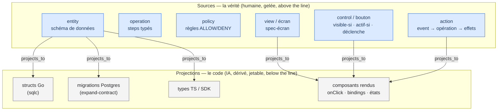
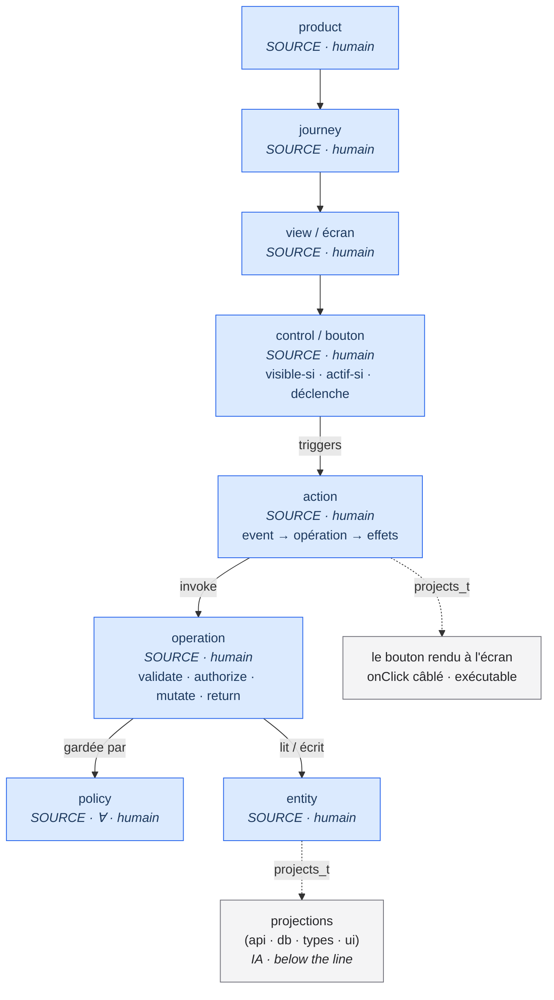
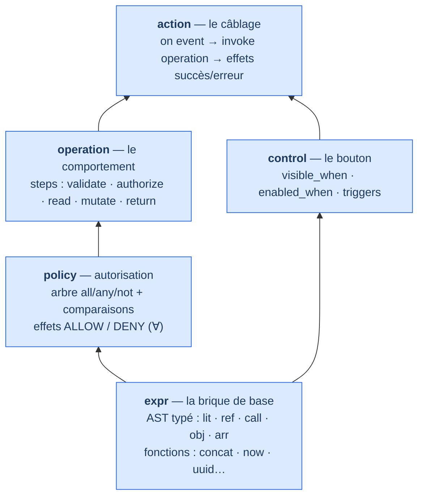

<Note>
  Côté concept — aucune ligne de code. Cette page décrit le **méta-modèle de couches** de KRD : il est vrai quelle que soit l'implémentation. Pour voir où en est la construction d'AIDOS, des marqueurs « (à venir) » signalent les capacités pas encore bâties.
</Note>

## En une phrase

Dans KRD, il n'y a **pas** une liste figée de « niveaux ». Il y a un seul méta-type : la **couche** (`Layer`). Un écran est une couche, une entité est une couche, une policy est une couche, un **bouton** est une couche, son **action** est une couche. Chacune est soit une **source** de vérité (peu nombreuse, humaine, gelée), soit une **projection** dérivée (le code, la base, les types, l'UI — régénérables par l'IA).

La grande idée tient en une inversion : la source est la vérité, **le code en découle** — jamais l'inverse. Et cette vérité descend en **verticale** sans jamais sortir du noyau : d'une intention jusqu'au bouton précis à l'écran et à ce qu'il déclenche.

## N0–N5 n'était qu'un profil

Si vous avez croisé les niveaux de preuve [N0…N5](/concepts/proof-levels) (journey, invariant, workflow, contrat, unité, infra), sachez que ce n'était **qu'un exemple**, pas la vérité du méta. KRD ne connaît qu'**un seul méta-type : la couche**. UI, Entité, API, Base, Bouton, Action en sont des *valeurs* — N0–N5 aussi.

« Ajouter une couche au-dessus » revient simplement à instancier une valeur de plus. Les mécaniques de KRD — le [mur](/internals/the-wall-and-ratchet), le cliquet, la complétude — n'opèrent pas sur des noms de barreaux gravés dans le marbre ; elles opèrent sur la **grammaire** des couches. C'est ce qui rend le système extensible sans jamais le réécrire.

<Tip>
  Retenez la formule : **tout est une couche**, et une couche est *soit* une source *soit* une projection. Tout le reste découle de cette distinction.
</Tip>

## L'enregistrement `Layer`

Une couche n'est pas un fichier ni un dossier : c'est un **enregistrement** (`Layer`), une donnée du noyau. Le déclarer revient à remplir quelques cases, et le harnais en déduit automatiquement le contrat, le sensor et les liens.

<Columns cols={2}>
  <Card title="kind" icon="tag">
    La nature de la couche : `product`, `journey`, `view`, `component`, `control`, `action`, `operation`, `policy`, `entity`, `api`, `db`, `type`, `budget`, ou un `kind` futur.
  </Card>
  <Card title="owner" icon="user">
    Qui la possède : `human`, `ai`, ou `derived`. L'humain possède les sources de vérité ; l'IA possède les projections.
  </Card>
  <Card title="authority" icon="scale-balanced">
    Où elle se situe par rapport à la **ligne de flottaison** : `above-waterline` (vérité, gelée) ou `below-waterline` (l'IA auto-certifie).
  </Card>
  <Card title="role" icon="arrows-split-up-and-left">
    Le pivot : **SOURCE** de vérité, ou **PROJECTION** dérivée d'une ou plusieurs sources.
  </Card>
  <Card title="sensor" icon="gauge">
    Comment c'est vérifié : `computational` (déterministe), `inferential`, ou `meter`.
  </Card>
  <Card title="links" icon="link">
    Ses liens versionnés vers d'autres couches : `projects_to`, `derives_from`, `contracts_with`, `triggers`, `binds`, `mirrors` — chacun épinglé sur une version.
  </Card>
</Columns>

Cinq attributs portent tout — **owner, authority, role, sensor, links** — et une projection ajoute son **generator** (l'émetteur déterministe qui la fabrique). Déclarer une couche, c'est remplir ces cases ; le harnais instancie le reste.

<Note>À venir : l'enregistrement `Layer` lui-même existe déjà comme record du noyau (étape S02). Les couches `expr`, `policy`, `operation`, `control` et `action` sont faites (S08 à S11). La couche `entity` comme source à part entière (S35) et les émetteurs qui produisent les projections (S34/S36/S37) sont **à venir**.</Note>

## L'idée qui débloque tout : source vs projection

C'est le keystone de toute l'architecture. On répartit chaque couche en deux familles :

<Columns cols={2}>
  <Card title="Sources" icon="seedling" color="#2563EB">
    **Peu nombreuses, humaines, gelées, au-dessus de la ligne.** Ce sont les vérités : `product`, `journey`, `view`, `control`, `action`, `operation`, `policy`, `entity`. Elles ne se génèrent pas — elles se décident.
  </Card>
  <Card title="Projections" icon="copy" color="#71717A">
    **Dérivées, écrites par l'IA, jetables, cliquetées, sous la ligne.** Ce sont les conséquences : `api`, `db`, `type`, `ui` (web / mobile / autre). Chacune a son émetteur déterministe et son sensor.
  </Card>
</Columns>



L'inversion est consciente, pas un détail : l'idée naïve « génère mon app depuis les écrans et les entités » devient « **les écrans sont du sortant dérivé**, et le modèle comportemental est l'entrant ». Le générateur full-stack n'est pas posé *à côté* de KRD — c'est sa **boucle interne** : le noyau (sources) est la vérité unique, le code (projections) en découle, et chaque projection porte son sensor qui demande sans cesse « est-ce que je satisfais encore ma source ? ».

<Warning>
  Le sens du lien ne s'inverse jamais. Vous ne corrigez pas un comportement en éditant la projection (le code généré) — vous changez la **source**, et la projection se régénère. Éditer une projection à la main, c'est mentir au cliquet : AIDOS protège les fichiers générés contre la modification manuelle.
</Warning>

## La verticale complète : de l'intention au bouton et son action

Voici le cœur de la page. Une capacité ne s'arrête pas à « l'API existe » : elle **descend** jusqu'au bouton précis à l'écran et à ce qu'il fait. Et le bouton comme l'action sont des **sources de première classe**, pas des détails d'implémentation.



| Couche (`kind`) | Vérité portée | role | owner / authority |
|---|---|---|---|
| **product** | énoncé de capacité + critères d'acceptation | SOURCE | human / above |
| **journey** | parcours utilisateur (Gherkin) | SOURCE | human / above |
| **view / écran** | spec-écran (but, zones, données affichées) | SOURCE | human / above |
| **control / bouton** | *existe, libellé, visible-si P, actif-si Q, déclenche A* | **SOURCE** | human / above |
| **action** | *event → invoque op O(args) ; succès → effet ; erreur → effet* | **SOURCE** | human / above |
| **operation** | steps typés validate / authorize / read / mutate / return | SOURCE | human / above |
| **policy** | arbre de règles ALLOW / DENY (∀) | SOURCE | human / above |
| **entity** | schéma — le modèle de données | SOURCE | human / above |
| **api · db · type · composants rendus** | routes, migrations, types, onClick | PROJECTION | derived / ai · below |

L'existence d'un bouton — « visible-si le panier n'est pas vide, actif-si le formulaire est valide, déclenche `checkout` » — est une **vérité falsifiable gelée** que l'UI générée doit satisfaire et que le cliquet protège. Changez la condition `enabled_when`, et le handler généré vire au rouge : c'est exactement le signal que vous voulez.

## Le comportement en DSL, jamais en code libre

Une vérité doit être *exécutable* et *versionnable* sans dépendre de code libre. KRD exprime donc tout le comportement — jusqu'au bouton — au moyen d'une petite famille de **DSL** (langages dédiés), chacun une couche typée. Ces DSL s'empilent : l'Expr est la brique de base ; tout le reste s'appuie dessus.



<AccordionGroup>
  <Accordion title="expr — la brique de base" icon="code">
    Un AST JSON typé : variantes `lit` / `ref` / `call` / `obj` / `arr`, des fonctions (`lowercase`, `concat`, `now`, `uuid`, `randomToken`…), des racines (`$.input`, `$.auth.user`…). C'est ce qui rend les conditions du bouton (`visible_when`, `enabled_when`) exécutables et versionnables — **sans code libre**. *(fait — étape S08)*
  </Accordion>
  <Accordion title="policy — l'autorisation" icon="shield-halved">
    Un arbre récursif de règles : combinateurs `all` / `any` / `not`, comparaisons, `exists` / `matches`. Scopes RESOURCE / OPERATION / ENTITY / FIELD, effets ALLOW / DENY — tous les ALLOW doivent passer, n'importe quel DENY bloque. C'est un invariant (∀). *(fait — étape S09)*
  </Accordion>
  <Accordion title="operation — le comportement" icon="gears">
    Le corps d'une opération est une liste de **steps typés** (validate / authorize / read / mutate / branch / return). Sa vérité est une **fixture** *état → commande → événements* (un workflow), plus la policy qui la garde. *(fait — étape S10)*
  </Accordion>
  <Accordion title="control — le bouton" icon="hand-pointer">
    Un *control-spec* : le bouton existe, porte un libellé (i18n), est visible si une condition Expr est vraie, actif si une autre l'est, et déclenche une action. C'est une fixture (situation → état du bouton). *(fait — étape S11)*
  </Accordion>
  <Accordion title="action — le câblage" icon="bolt">
    Un *action-spec* : sur tel `event` (un clic), `invoke` telle opération avec tels arguments, puis des effets `on_success` et `on_error` (naviguer, afficher un toast…). L'action **lie** (`binds`) le bouton à l'opération. *(fait — étape S11)*
  </Accordion>
</AccordionGroup>

Voici à quoi ressemble la vérité d'un bouton et de son action — non pas du code, mais une **spec figée** que la projection devra satisfaire :

```text Le bouton et son action, en DSL (vérité, pas implémentation)
control "checkout-button" {
  view: "cart"
  label: i18n("cart.checkout")
  visible_when:  $.cart.items.length > 0      # Expr DSL — AST typé, pas de code
  enabled_when:  $.form.valid && !$.submitting
  triggers: action "checkout-submit"
}

action "checkout-submit" {
  on: click("checkout-button")
  invoke: operation "createOrder" with { cart: $.cart, user: $.auth.user }
  on_success: [ navigate("/orders/{result.id}"), toast("order.created") ]
  on_error:   [ toast.error($.error.message) ]
}
```

Le `onClick` réellement câblé dans le composant n'est qu'une **projection** de cette source. *Aucun comportement n'est écrit en code libre côté vérité* — le principe « le comportement s'exprime en Operation / Policy / Expr » est poussé **jusqu'au bouton**.

## Le registre et « ajouter une couche »

Quels `kind` sont actifs dans votre projet ? C'est le **registre** qui le déclare, avec leurs méta-attributs. C'est un artefact du noyau, versionné, au-dessus du mur. Ajouter une couche est une procédure uniforme — et c'est *ça*, l'extensibilité de KRD :

<Steps>
  <Step title="Déclarer">
    Vous ajoutez le `kind` et ses méta-attributs (owner, authority, role, sensor) au registre. C'est un acte humain, above the line.
  </Step>
  <Step title="Lier">
    Vous posez ses `links` — épinglés sur version — vers les couches existantes (par exemple, une nouvelle source qui `projects_to` les écrans).
  </Step>
  <Step title="Émettre">
    Vous fournissez son générateur et son sensor, ou vous les héritez d'une topologie existante.
  </Step>
</Steps>

Vous pouvez ainsi ajouter une couche **au-dessus** de l'UI (`capability`, `design-system`, `orchestration`, `agent` — toutes sources, qui se projettent vers les écrans) ou **en dessous** (`observability`, `deployment`, `feature-flag` — projections et budgets). **Aucun changement aux primitifs** : le cliquet, le mur et les boucles continuent de fonctionner, parce qu'ils ne voient que la grammaire des couches, jamais leurs noms.

<Note>À venir : le registre comme artefact du noyau et l'ajout dynamique de `kind` arbitraires (couches `capability`, `design-system`, etc.) sont une capacité **à venir**. Aujourd'hui, les couches faites sont `Layer` (S02), `expr` (S08), `policy` (S09), `operation` (S10), `control` et `action` (S11). La couche `entity` comme source (S35) et les émetteurs de projections (S34, S36, S37) sont **à venir**.</Note>

## Pour aller plus loin

<Columns cols={2}>
  <Card title="Les niveaux de preuve" icon="layer-group" href="/concepts/proof-levels">
    N0…N5 : non pas la vérité du méta, mais un profil de couches utile — une preuve par nature de vérité.
  </Card>
  <Card title="L'app que vous obtenez" icon="rocket" href="/guide/your-app">
    Concrètement, les projections émises depuis vos sources : web, mobile, CLI, API, base — bilingue par défaut.
  </Card>
</Columns>
