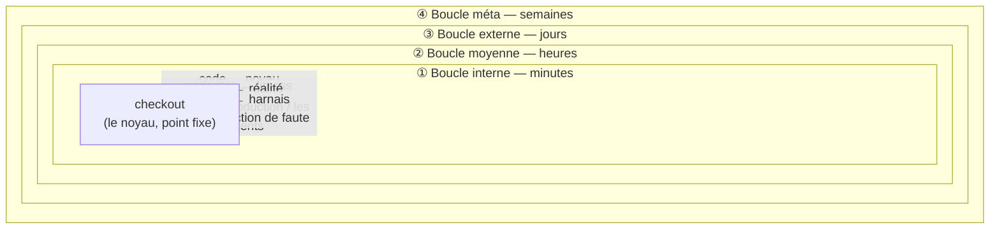
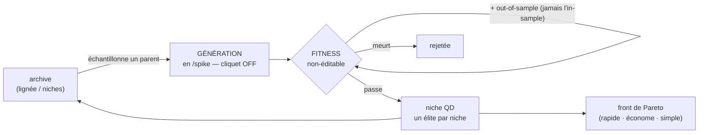
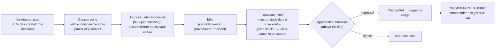
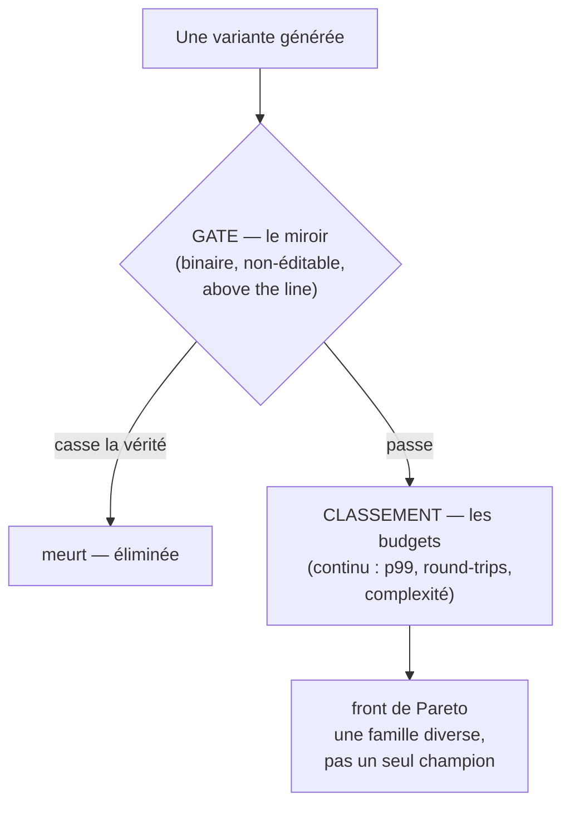

<Note>
  Côté concept — aucune ligne de code. Cette page décrit la **physiologie** de KRD : le système *en train d'apprendre*. C'est la vision de la méthode ; plusieurs des capacités décrites ici sont construites plus tard dans le build d'AIDOS (chaque mention « à venir » indique la phase concernée).
</Note>

## En une phrase

Un système qui s'auto-améliore a un seul vrai danger : **noter sa propre copie**. C'est Goodhart, c'est l'overfitting, c'est la circularité. AIDOS fait tourner une boucle d'évolution comme les autres — mais avec une fonction de fitness qu'elle **ne peut pas éditer** : le **miroir**, ancré par un humain, hors de portée de l'IA. C'est ce qui fait d'AIDOS un système *auto-évolutif **ancré*** — libre sur l'implémentation, enchaîné à la vérité.

## Le problème que ça résout

La littérature de l'auto-évolution (machines qui réécrivent leur propre code, évolution de stratégies, self-play) sait toute faire tourner la boucle. Aucune ne règle proprement une question : **qui tient le mètre-étalon ?** Si la boucle peut bouger sa propre cible, elle finit par optimiser la cible plutôt que le réel — elle triche sans le savoir.

KRD répond avec une seule règle, rejouée à chaque niveau :

> **Aucune boucle n'édite sa propre fitness.**

Et une règle pour la boucle qui modifie le harnais lui-même :

> **La boucle méta peut AJOUTER une capacité, JAMAIS RETIRER un garde-fou.**

Voir [Le noyau & le miroir](/concepts/kernel-mirror) pour le couple intention/preuve, et [Le goal & le workflow](/concepts/goal-and-workflow) pour la boucle la plus rapide.

## Les quatre boucles emboîtées

Le **noyau** est le point fixe. Quatre boucles l'orbitent, de la plus rapide à la plus lente. Chacune fait évoluer quelque chose de différent, à un rythme différent — et chacune a une fitness qu'elle ne peut pas toucher.



<Columns cols={2}>
  <Card title="① Boucle interne — le TDD" icon="rotate-cw">
    **Code ← noyau** (déduction), en **minutes**. Fait évoluer l'**implémentation**. Fitness non-éditable : le **miroir red→green**. Geste : `/goal`.
  </Card>
  <Card title="② Boucle moyenne — l'évolution" icon="dna">
    **Variantes ← fitness** (évolution), en **heures**. Fait évoluer le code, les stratégies, les prompts. Fitness : sensors **computational** + **out-of-sample**. Geste : `/evolve`.
  </Card>
  <Card title="③ Boucle externe — la réalité" icon="globe">
    **Noyau ← réalité** (induction), en **jours**. Fait évoluer **la vérité elle-même**. Fitness : la **production**, les **incidents**. Déclencheur : la télémétrie.
  </Card>
  <Card title="④ Boucle méta — le harnais" icon="wrench">
    **Harnais ← harnais**, en **semaines**. Fait évoluer les **sensors**, les topologies, les skills. Fitness : l'**injection de faute**. Déclencheur : l'auto-test.
  </Card>
</Columns>

| Boucle | Direction | Rythme | Fait évoluer | Fitness (non-éditable) | État dans AIDOS |
|---|---|---|---|---|---|
| ① **Interne** | code ← noyau | minutes | l'implémentation | le miroir red→green | substrat câblé (miroirs + cert-runners S06–S14, mur S04) ; moteur `/goal` complet **à venir (S29)** |
| ② **Moyenne** | variantes ← fitness | heures | code, stratégies, prompts | computational + out-of-sample | EvolutionSandbox **à venir (S42)** |
| ③ **Externe** | noyau ← réalité | jours | la vérité elle-même | la production / les incidents | RealityMirror **à venir (S43)** ; on-ramp `learn` **à venir (S30+)** |
| ④ **Méta** | harnais ← harnais | semaines | sensors, topologies, skills | injection de faute | fitness méta-méta **à venir (S39)** |

<Tip>
  La boucle interne — celle que vous vivrez à chaque `/goal` — est la plus avancée : son substrat (les miroirs et leurs cert-runners, le mur) est déjà câblé, et le moteur `/goal` complet arrive avec S29. Les trois boucles plus lentes sont la **vision** : AIDOS se construit tooth-by-tooth, et chacune arrive à son étape.
</Tip>

## ① La boucle courte — le TDD (déjà là)

La plus rapide. Vous déplacez un cran du noyau (une nouvelle vérité, avec son miroir) ; ce miroir, qui ne reflète encore aucun code, est **rouge**. Ce rouge *est* le but. L'IA réconcilie le code, tranche par tranche, jusqu'au vert — et l'arrêt n'est **pas** « quand l'agent pense avoir fini », mais une condition déterministe.

```text Boucle interne (l'arrêt non-gameable)
commit(delta_noyau)                  # humain, au-dessus du mur
rouge ← tests_consommant(delta)      # le set rouge = le but
tant que rouge non vide :
    tranche ← rouge.plus_externe()   # outside-in, une tranche
    code   ← agent.réconcilie(tranche)
    si sensors_computational == vert : rouge.retire(tranche)
# ARRÊT NON-GAMEABLE :
assert set_rouge_devenu_vert ∧ set_vert_antérieur_intact ∧ score_mutation ≥ seuil
```

C'est tout le sujet du [goal & workflow](/concepts/goal-and-workflow) : la condition d'arrêt est calculée, jamais auto-déclarée.

## ② La boucle moyenne — l'évolution, en quarantaine

Une opération comme `createOrder` a **un** miroir fixe (l'oracle). Mais son *implémentation* peut exister en dizaines de variantes qui passent toutes ce miroir, et qui varient sur des axes réels : calcul du total (naïf · mémoïsé · pré-calculé), écriture (séquentielle · transaction · batchée), retry (aucun · backoff · idempotence), lecture (requête unique · jointure).

AIDOS génère ces variantes, puis les soumet au miroir. Résultat concret du Tome : sur **12 variantes**, le miroir et le property test en tuent **9** (elles cassaient la vérité — total faux sous concurrence, autorisation contournée). Restent **3 élites** : *rapide*, *économe*, *simple*. Le système a appris de meilleures implémentations d'une vérité fixe, **sans jamais pouvoir tricher**.



<AccordionGroup>
  <Accordion title="L'EvolutionSandbox — l'évolution explore, elle ne gouverne pas" icon="box">
    Toute boucle `/evolve` tourne en **quarantaine**. Elle peut écrire des **branches**, des **rapports**, des **idées proposées** — jamais le `kernel`, les `mirrors` au-dessus de la ligne, l'`authority` ou la `fitness`. Une variante n'est **promue** dans une niche que si elle porte un **miroir vert** ∧ un vert **out-of-sample** ∧ l'**approbation** de l'autorité. L'évolution produit des candidats, des scores, des hypothèses — jamais des vérités, des approbations ou des droits.
    <Note>À venir (S42) — l'EvolutionSandbox est une étape future du build.</Note>
  </Accordion>
  <Accordion title="L'archive Quality-Diversity — la mémoire qui apprend" icon="grip">
    L'archive de versions d'AIDOS **est** une archive de quality-diversity (MAP-Elites) : les liens généalogiques forment l'arbre de lignée, les phases stables sont les élites, la diversité des cellules sont les niches. Le moteur évolutif était déjà dans le versioning. Quand un nouveau goal arrive, le système ne repart pas de zéro : il **échantillonne l'archive**, y compris de vieilles variantes « faibles » (*stepping stones*) qui redeviennent bonnes dans un nouveau contexte. C'est ce qui fait qu'il *apprend* au lieu de regénérer.
    <Note>À venir (S24) — le DAG de versions / archive QD est une étape future.</Note>
  </Accordion>
  <Accordion title="Le self-play — durcir sans annotation" icon="swords">
    Trois rôles, depuis le même modèle : **Proposer** génère des cas limites (panier vide, double-submit, rupture de stock, prix qui change en vol), **Solver** implémente la gestion, **Judge** note. Le point critique : **le Judge n'est PAS un LLM qui note sa propre copie** — c'est le miroir déterministe. C'est la différence entre du self-play livré tel quel (le juge est le danger) et KRD (le juge est ancré).
  </Accordion>
</AccordionGroup>

## ③ La boucle longue — le noyau peut avoir tort

C'est la boucle la plus profonde, et la plus contre-intuitive. Le noyau n'est **pas** « la vérité » : c'est une **théorie falsifiable** du domaine, donc faillible. Vous pouvez approuver une fixture qui encode un bug — alors le cliquet *défend le bug*. KRD, pris seul, est une boucle de contrôle fermée (noyau → code → test → vert) sans référence au sol.

> **La seule chose qui peut dire que le noyau est faux, c'est la réalité.**

D'où deux cliquets :

- **Cliquet interne** (déduction) : le code conforme au noyau.
- **Cliquet externe** (induction) : le noyau conforme à la réalité. Tout incident de production doit se refermer en un **delta de noyau** — soit une fixture/un invariant manquant (le bug devient un test épinglé), soit la découverte qu'une contrainte était fausse (un override).

La production devient ainsi un **sensor qui écrit dans le noyau** — au-dessus de la ligne, car juger un désaccord avec le réel est une **décision de vérité**, jamais automatique.

<Info>
  Bonus épistémique : une contrainte validée par un **incident réel** est haute-confiance ; une contrainte écrite **spéculativement** d'avance n'est qu'une hypothèse. AIDOS scrute donc d'abord les spéculatives au mutation testing.
</Info>

### « L'incident devient un miroir » — la seule rampe d'accès du réel vers le noyau

C'est le cœur de la boucle longue, et le seul chemin légal de la production vers la vérité. Un incident ne corrige jamais le noyau tout seul : il remonte comme une **idée**, devient un **miroir**, et n'entre qu'après **approbation humaine**.



Le système a **appris du monde**, pas de lui-même. C'est l'apprentissage *ancré* par excellence — l'incident traverse exactement le même flux que toute vérité : `idée → miroir → goal → approbation`, jamais une écriture directe dans le noyau.

<Note>À venir — la **RealityMirror** (divergence prod ↔ miroir) est l'étape **S43** ; la rampe `learn` (transformer un signal/incident en idée avec provenance) est **S30+**. Aujourd'hui le flux `idée → miroir → goal` existe ; la captation automatique depuis la télémétrie est à venir.</Note>

## ④ La boucle méta — ajouter un sensor après un incident

La boucle la plus lente fait évoluer le **harnais lui-même** : les sensors, les topologies d'agents, les skills. Exemple : des commandes en double apparaissent (double-clic sur « Payer »). Aucun sensor ne testait la concurrence — un angle mort du harnais. La boucle méta **ajoute** un détecteur :

```text Boucle méta — ajouter un sensor (jamais en retirer)
sensor "concurrency-double-submit" :
    rejoue 2 createOrder simultanés → asserte 1 seule commande
# désormais l'injection de faute inclut ce cas
# RÈGLE DURE : elle a AJOUTÉ un garde-fou. Elle n'en a RETIRÉ aucun.
```

Et son unique anti-dérive : le harnais **se teste lui-même**. On plante une violation connue ; on asserte que le sensor vire au rouge. Un détecteur qui ne fire jamais est **mort**.

```text Auto-test du harnais (le seul anti-dérive de la boucle méta)
pour chaque sensor s :
    faute ← planter_violation_connue(s)
    assert s.fire_rouge(faute)              # un détecteur qui ne fire pas est MORT
assert mur.refuse(écriture_noyau_par_agent())   # le mur tient toujours
assert fitness.non_modifiée_par(boucle_méta)    # la méta n'a retiré aucun garde-fou
```

<Note>À venir (S39) — la fitness méta-méta (lecture seule) et l'auto-test `SessionStart` par injection de faute. La règle « ajouter, jamais retirer » est, elle, déjà gravée dans le contrat du projet.</Note>

## Le miroir est l'ancre de fitness

C'est la phrase qui commande tout le système vivant. La fitness se lit en **deux étages** :

<Steps>
  <Step title="Un gate binaire — le miroir" icon="lock">
    Passe ou meurt. C'est l'**ancre** : non-gameable, *above the line*, hors de portée de l'IA. Une variante qui casse la vérité est éliminée, point — quelle que soit sa vitesse.
  </Step>
  <Step title="Un classement continu — les budgets" icon="gauge">
    Parmi les survivants seulement, on classe : qui est le plus rapide, le plus économe, le plus simple. C'est ici qu'émerge le front de Pareto.
  </Step>
</Steps>

Sans l'étage gate, l'évolution optimiserait la vitesse en cassant la vérité — overfit garanti. Le couple **bicéphale** (intention + preuve) *est* ce gate. C'est *là* qu'est l'ancrage que le mot « auto-évolutif **ancré** » promet : l'évolution ne peut pas tricher, parce que le juge n'est pas elle.



<Warning>
  Le danger que tout cela écarte est unique : un système qui **note sa propre copie**. Tant que le miroir reste hors de portée de la boucle, l'évolution est sûre. Le jour où une boucle pourrait éditer sa fitness, elle redeviendrait du *vibe coding* déguisé en science.
</Warning>

## Pour résumer

<Columns cols={2}>
  <Card title="Quatre boucles, un point fixe" icon="circle-dot">
    Interne (minutes, TDD), moyenne (heures, évolution), externe (jours, réalité), méta (semaines, harnais) — toutes orbitent un noyau qu'aucune ne peut s'auto-attribuer.
  </Card>
  <Card title="Le miroir, jamais éditable" icon="anchor">
    L'évolution est libre sur l'implémentation, enchaînée à la vérité. Un variant n'est promu qu'avec un miroir vert. Le juge est déterministe, jamais l'agent lui-même.
  </Card>
  <Card title="L'incident devient un miroir" icon="route">
    La seule rampe d'accès du réel vers le noyau : `incident → idée → miroir → approbation → vague de rouge`. Le système apprend du monde, pas de lui-même.
  </Card>
  <Card title="La méta ajoute, ne retire jamais" icon="shield-plus">
    Le harnais évolue par accrétion de garde-fous, et se vérifie par injection de faute. Un sensor qui ne fire jamais est mort.
  </Card>
</Columns>

<Card title="Voir aussi — le noyau & le miroir" icon="book" href="/concepts/kernel-mirror">
  Le couple bicéphale intention/preuve qui sert d'ancre de fitness à tout le système vivant — et la loi de complétude qui interdit le **monstre** (une vérité sans miroir, ou un miroir orphelin).
</Card>
