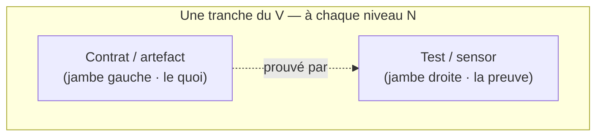
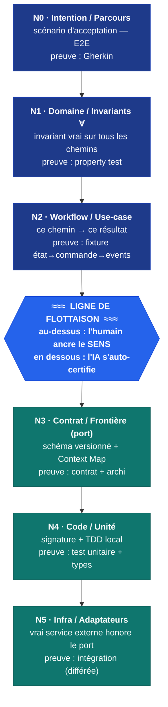
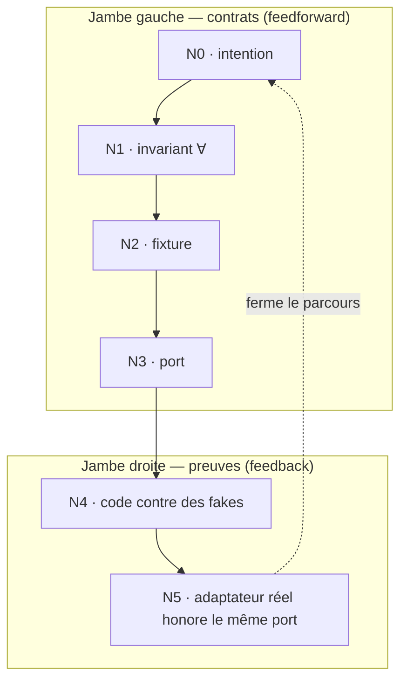

<Note>
  Côté concept — aucune ligne de code. Cette page décrit la **méthode** KRD : les six couches de preuve sont vraies indépendamment de l'état d'avancement d'AIDOS. Là où une capacité n'est pas encore construite, vous trouverez un repère « à venir ». Pour la mécanique vue du dedans (le mur, le cliquet, la complétude), voir [Pour moi → Le mur et le cliquet](/internals/the-wall-and-ratchet).
</Note>

## En une phrase

Un comportement n'est jamais prouvé « en bloc » : il est prouvé **par tranches**, à six altitudes différentes. KRD nomme ces altitudes **N0 à N5** — du *parcours* qu'un humain reconnaît (N0) jusqu'au *branchement* d'un vrai service externe (N5). Chaque niveau prouve une chose précise, avec une forme de preuve précise, et possède une règle précise : **qui a le droit de dire « c'est vert »**.

Et c'est là tout le cœur : une ligne — la **ligne de flottaison** — passe entre N2 et N3. Au-dessus, c'est le territoire de l'humain (le *sens*). En dessous, c'est le territoire de l'IA (le *déterminisme*).

## Le problème que ça résout

« Le test passe » ne veut rien dire si l'on ne sait pas *quel genre de chose* le test prouvait. Tester un invariant avec un exemple, c'est sous-tester une règle ; tester un workflow avec une propriété abstraite, c'est sur-spécifier un chemin. Et laisser une IA se déclarer verte sur la *signification* d'un parcours métier, c'est lui demander de noter sa propre copie.

KRD répond en stratifiant la preuve. Chaque niveau est une **tranche du V** : à gauche un contrat (l'artefact, le *quoi*), à droite un test (le sensor, la *preuve*). Le niveau dit à la fois quelle forme de preuve est juste **et** à qui revient le verdict.

## Les six couches, d'un coup d'œil

<Steps>
  <Step title="N0 · Intention / Parcours" icon="route">
    Prouve qu'un **parcours utilisateur** complet fait ce que l'humain attend, de bout en bout. Forme de preuve : un **scénario d'acceptation** approuvé (*Given / When / Then*). Verdict : **l'humain** — l'agent ne se déclare jamais vert sur le sens d'un parcours.
  </Step>
  <Step title="N1 · Domaine / Invariants (∀)" icon="infinity">
    Prouve une **règle métier vraie sur *tous* les chemins** — un invariant, indépendant du chemin. Forme de preuve : une **propriété** (∀), pas un exemple. Verdict : ancrage humain — l'agent peut faire passer l'existant, jamais inventer une nouvelle règle.
  </Step>
  <Step title="N2 · Workflow / Use-case" icon="diagram-project">
    Prouve que *ce* chemin précis produit *ce* résultat précis. Forme de preuve : une **fixture** `état → commande → état + events`, l'exemple canonique gelé. Verdict : ancrage humain — l'agent ajoute des variantes, jamais ne touche au canon gelé.
  </Step>
  <Step title="N3 · Contrat / Frontière (port)" icon="plug">
    Prouve que les **frontières** entre morceaux tiennent : schémas versionnés, contrats de **port** (l'interface dessinée *du dedans*). Forme de preuve : schéma versionné + Context Map + contrats inter-cellules. Verdict : **l'IA s'auto-certifie**.
  </Step>
  <Step title="N4 · Code / Unité" icon="code">
    Prouve qu'une **fonction** fait ce que sa signature promet. Forme de preuve : test unitaire + TDD local, doublé du typage strict comme sensor gratuit. Verdict : **l'IA s'auto-certifie**.
  </Step>
  <Step title="N5 · Infra / Adaptateurs" icon="server">
    Prouve que l'**adaptateur réel** (vraie base, vrai service externe) honore le *même contrat N3* que le fake. Forme de preuve : vérification de contrat fournisseur + tests d'intégration sur de vrais systèmes. Verdict : **différé** — on le branche tard, et le tracer bullet en valide la forme tôt.
  </Step>
</Steps>

## La pile N0→N5 et la ligne de flottaison

Voici le cœur visuel. La pile va du parcours (en haut) à l'infra (en bas). La **ligne de flottaison** passe entre N2 et N3 — elle est la même frontière que le [mur](/internals/the-wall-and-ratchet), vue sous l'angle « qui certifie ».

Lisez la pile ainsi : **lourde en haut, légère en bas**. N0/N1/N2 portent version + approbation + preuve, et restent **ancrés par un humain** ; N3 est intermédiaire (un schéma versionné, mais auto-certifié) ; N4 ne porte qu'une exécution. Plus on descend, moins une preuve coûte cher à rejouer — et plus elle peut tourner à chaque diff sans intervention humaine.

<Warning>
  La ligne de flottaison n'est pas une commodité, c'est la garantie anti-circularité. Si l'agent pouvait se déclarer vert au-dessus de la ligne, il validerait sa propre interprétation du *sens* — exactement le piège de Goodhart que KRD ferme. Au-dessus de la ligne, **l'agent propose, l'humain tranche**.
</Warning>

## Le « V » : descendre une fois, remonter une fois

Les six niveaux ne s'écrivent pas dans le désordre. On les parcourt en **V** : on descend la jambe gauche en posant les contrats (du parcours vers le code), puis on remonte la jambe droite en prouvant (du code vers le parcours). Le mock est interdit au cœur (N1/N2), toléré seulement aux frontières (N3).

L'ordre est *principiel*, pas pratique : on **diffère N5** parce que le contrat de frontière (N3) est le **port**, et l'infra n'en est qu'un **adaptateur**. Le code ne dépend jamais de l'infra ; c'est l'infra qui dépend du code (l'inversion de dépendance hexagonale). C'est ce qui permet à tout le bas du V de rester *computational* — déterministe, rapide, rejouable à chaque diff. **La différabilité de N5 est la testabilité de N0–N4 : le même fait vu des deux côtés.**

<Tip>
  Pour éviter de découvrir trop tard qu'un port est mal dessiné, on tire un **tracer bullet** : un seul branchement réel de bout en bout, tôt, juste pour valider la forme du port *avant* d'empiler quarante use-cases dessus. C'est le « walking skeleton ».
</Tip>

## Métier vs Fonctionnel — la distinction qui sauve

La confusion la plus coûteuse oppose N1 et N2. Elle mérite son propre repère :

<Columns cols={2}>
  <Card title="N1 · Métier (l'invariant ∀)" icon="infinity">
    « Vrai sur *tous* les chemins ». Une bande verticale qui traverse tout le système — par exemple : *jamais de session sans identifiants*, *un mot de passe n'est jamais loggé*. Se prouve par une **propriété** (∀), jamais par un exemple.
  </Card>
  <Card title="N2 · Fonctionnel (la fixture)" icon="diagram-project">
    « *Ce* chemin produit *ce* résultat ». Path-specific — par exemple : *connexion avec les bons identifiants → une session valide*. Se prouve par une **fixture**, un exemple canonique gelé.
  </Card>
</Columns>

On ne teste pas un invariant avec un exemple, et on ne teste pas un workflow avec une propriété. Choisir la mauvaise forme, c'est soit sous-tester une règle, soit sur-spécifier un chemin.

## Tableau récapitulatif

| Niveau | Prouve | Forme de preuve | Gate (qui certifie) |
|---|---|---|---|
| **N0** · Intention / Parcours | un parcours utilisateur de bout en bout fait ce que l'humain attend | scénario d'acceptation approuvé (Gherkin) | <Badge color="red">humain</Badge> ancrage obligatoire |
| **N1** · Domaine / Invariants ∀ | une règle métier vraie sur *tous* les chemins | propriété (∀), property test | <Badge color="orange">humain</Badge> passe l'existant, n'invente pas |
| **N2** · Workflow / Use-case | *ce* chemin produit *ce* résultat | fixture `état → commande → état + events` | <Badge color="orange">humain</Badge> variantes oui, canon gelé non |
| **N3** · Contrat / Frontière (port) | les frontières (ports, schémas) tiennent | schéma versionné + Context Map + contrats inter-cellules | <Badge color="green">IA</Badge> auto-certifie |
| **N4** · Code / Unité | une fonction fait ce que sa signature promet | test unitaire + TDD local + typage strict | <Badge color="green">IA</Badge> auto-certifie |
| **N5** · Infra / Adaptateurs | l'adaptateur réel honore le même contrat N3 que le fake | vérification de contrat fournisseur + intégration | <Badge color="blue">différé</Badge> tracer bullet tôt |

<Note>
  La frontière entre les badges <Badge color="orange">humain</Badge> (N2) et <Badge color="green">IA</Badge> (N3) **est** la ligne de flottaison.
</Note>

## Computational vs inferential

La ligne de flottaison repose sur une distinction de sensors. C'est elle qui décide *quand* et *comment* une preuve s'exécute.

<AccordionGroup>
  <Accordion title="Sensors computational — à chaque diff, l'IA s'auto-certifie">
    Types, lint, tests de fixture, property tests, tests d'architecture, mutation. **Déterministes, en millisecondes-secondes, fiables.** Ils tournent à chaque diff ; l'agent s'auto-corrige dessus sans intervention. C'est ce qui fait tout le bas du V (N3–N5) et les preuves exécutables au-dessus.
  </Accordion>
  <Accordion title="Sensors inferential — sous garde, post-intégration">
    Revue par un LLM, « LLM as judge », analyse sémantique. **Non-déterministes, lents, chers.** Ils réduisent le toil, ils ne remplacent pas l'humain sur le comportement. Un second agent qui valide un premier agent n'est **pas** une preuve — ne vous racontez pas le contraire.
  </Accordion>
</AccordionGroup>

Règle : **l'agent s'auto-corrige sur le computational ; il ne s'auto-certifie jamais seul sur le comportement métier.** C'est cette règle, rendue opérationnelle, qui *est* la ligne de flottaison.

## N0–N5 n'est qu'un *profil*

Dernier garde-fou contre la rigidité : N0→N5 n'est **pas** la vérité figée du système, c'est seulement **une instance** d'un méta-modèle plus simple. Le méta de KRD ne connaît qu'un seul méta-type : la **couche** (`Layer`). UI, Entité, API, Base, Bouton, Action — et N0…N5 — n'en sont que des *valeurs*. « Ajouter une couche au-dessus » revient à instancier une valeur de plus ; la ligne de flottaison, elle, ne bouge pas (elle est gravée dans la grammaire, hors de portée de l'IA).

<Note>
  Dans AIDOS, l'enregistrement `Layer` existe déjà et porte cette généralité. Les couches s'implémentent **étape par étape**, jamais en bloc : aujourd'hui les couches N0 (parcours, via Godog) et N1 (invariants, via les property tests) sont déjà câblées par les *cert-runners* du miroir. Les couches restantes arrivent au fil du cliquet.
</Note>

## Où ça en est dans AIDOS

<Info>
  Cette section est honnête sur le build, qui se construit dent par dent.
</Info>

- **Câblé aujourd'hui** : les *cert-runners* du miroir exécutent les preuves **N0** (parcours, en Gherkin/Godog) et **N1** (invariants ∀, en property tests). L'enregistrement `Layer` — le méta-modèle qui rend N0…N5 instanciables — existe également.
- **Au fil des étapes** : les couches **N2** (fixtures de workflow), **N3** (ports/contrats), **N4** (unité) et **N5** (adaptateurs) s'implémentent progressivement, chacune à son cran du cliquet, chacune avec son miroir vivant. La ligne de flottaison, elle, est posée d'emblée : c'est la même frontière que le mur.

## Pour aller plus loin

<Columns cols={2}>
  <Card title="Kernel et Mirror" icon="circle-half-stroke" href="/concepts/kernel-mirror">
    Le couple intention/preuve. Chaque couche de preuve a son miroir vivant ; le miroir a sa propre ligne de flottaison.
  </Card>
  <Card title="Le mur et le cliquet" icon="block-brick" href="/internals/the-wall-and-ratchet">
    La ligne de flottaison vue du dedans : la même frontière que le mur des permissions.
  </Card>
  <Card title="La stack figée" icon="layer-group" href="/internals/the-stack">
    Les outils choisis par niveau — Godog (N0), property tests (N1), fixtures (N2), contrats (N3), unité (N4), intégration (N5).
  </Card>
  <Card title="Couches et verticale" icon="diagram-next" href="/concepts/layers-and-vertical">
    Le méta-modèle `Layer` : N0…N5 n'est qu'un profil parmi d'autres.
  </Card>
</Columns>
