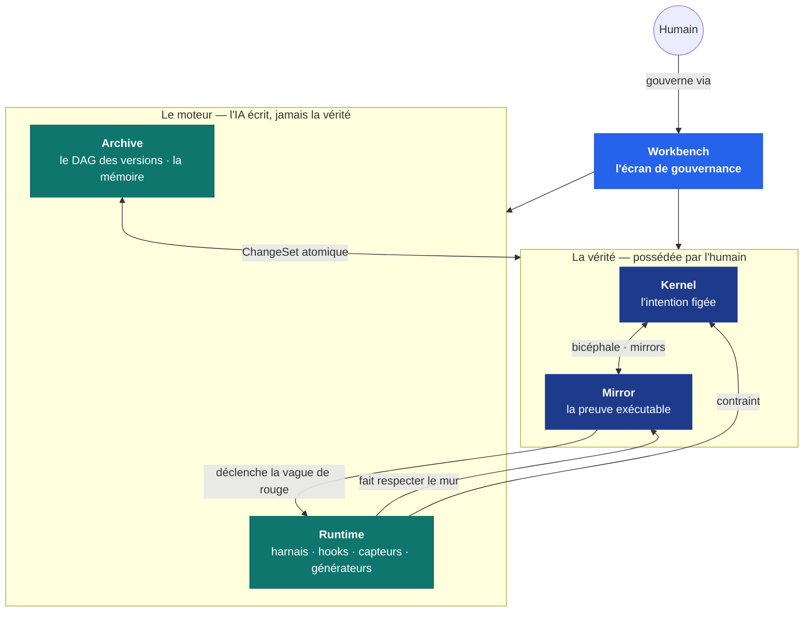
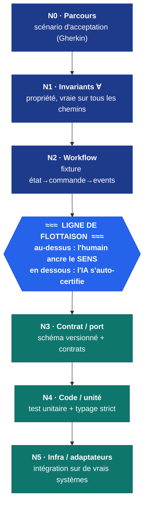
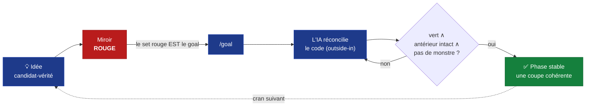
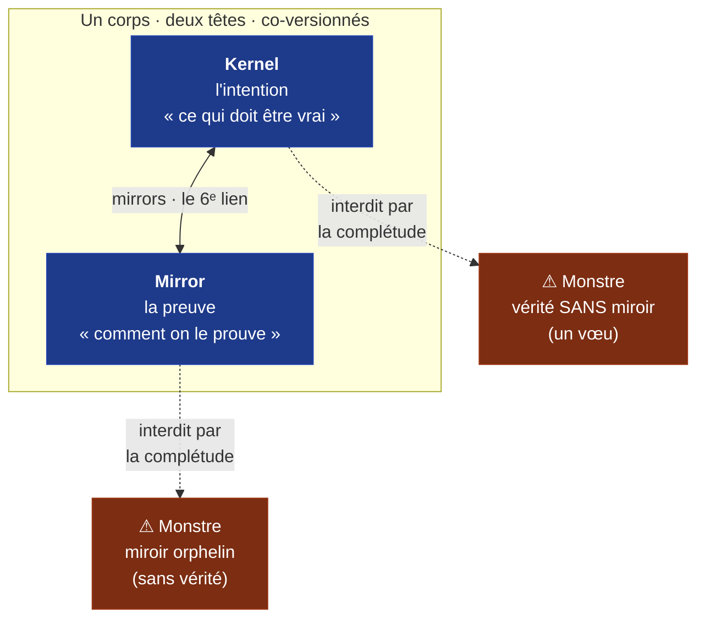
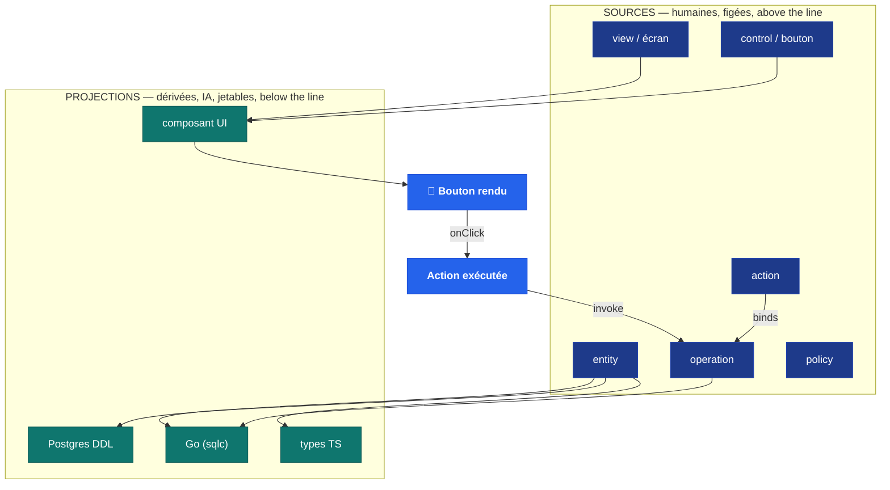
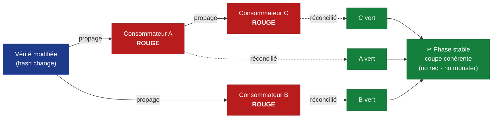
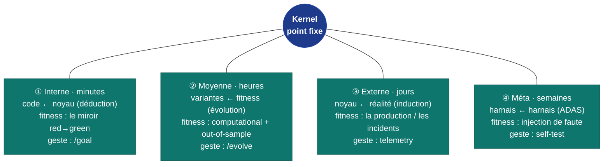
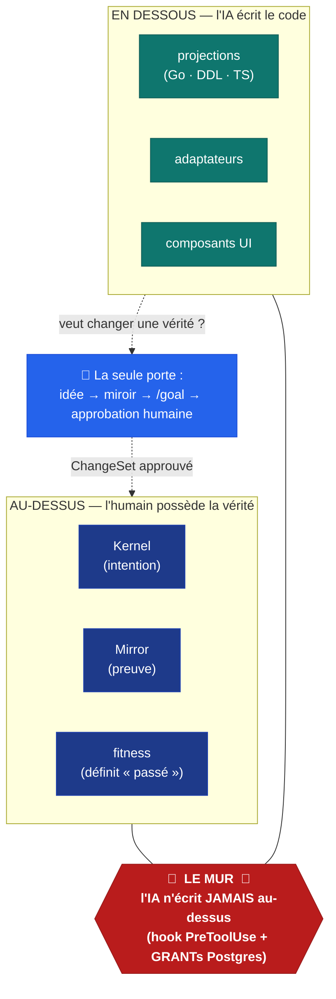

<Note>
  Cette page est une **visite guidée visuelle** : un schéma par grand concept, chacun
  relié à sa page détaillée. C'est la *table des matières en images* d'AIDOS — survolez,
  cliquez là où vous voulez approfondir.
</Note>

<Info>
  Certains éléments schématisés ici décrivent la **méthode KRD** et la **vision**
  d'AIDOS, vraies indépendamment de l'état d'avancement du build (qui se construit dent
  par dent). Chaque schéma renvoie à sa page concept, où l'**état d'implémentation** est
  détaillé honnêtement. Là où une capacité n'est pas encore câblée, vous trouverez un
  repère « à venir ».
</Info>

## En une phrase

AIDOS tient une petite **vérité** ancrée par un humain, la **prouve** par un miroir,
**contraint** le code que l'IA écrit librement, et **se souvient** de tout — et tout
cela se raconte mieux en schémas qu'en paragraphes. Voici les huit images qui suffisent
à comprendre l'ensemble.

---

## 1. Les cinq sous-systèmes

AIDOS se divise en cinq rôles qui se contraignent les uns les autres : le **Kernel**
tient l'intention, le **Mirror** la prouve, le **Runtime** fait respecter les règles et
produit le code, l'**Archive** se souvient, et le **Workbench** est l'écran par lequel
un humain gouverne.

<Card title="Les cinq sous-systèmes, en détail" icon="diagram-project" href="/concepts/five-subsystems">
  Ce qu'est chacun en langage clair, et comment ils se tiennent ensemble.
</Card>

---

## 2. Le « V » des couches de preuve N0→N5 et la ligne de flottaison

Un comportement n'est jamais prouvé en bloc : il est prouvé **par tranches**, à six
altitudes. Une seule ligne — la **ligne de flottaison** — passe entre N2 et N3 : au-dessus,
l'humain ancre le *sens* ; en dessous, l'IA s'auto-certifie sur le *déterminisme*.

<Card title="Les couches de preuve (N0–N5)" icon="layer-group" href="/concepts/proof-levels">
  Le « V », la ligne de flottaison, Métier vs Fonctionnel, computational vs inferential.
</Card>

---

## 3. Le cycle KRD

On n'implémente jamais en partant du code. On bouge un cran du Kernel — une **idée**
devient un **miroir rouge** (c'est ça, le `/goal`) — puis l'IA ramène le code au **vert**
sous la contrainte, jusqu'à une **phase stable**.

<Card title="Le goal et le workflow" icon="bullseye" href="/concepts/goal-and-workflow">
  Pourquoi le test rouge EST le goal, et la condition d'arrêt non-gameable.
</Card>

---

## 4. Le bicéphale Kernel ⇄ Mirror — et le monstre

Un seul corps — la vérité — avec **deux têtes** : l'intention (le Kernel) et la preuve
(le Mirror), reliées par le lien `mirrors` et **co-versionnées**. La **loi de complétude**
interdit toute vérité sans miroir vivant et tout miroir orphelin : ce sont des **monstres**.

<Card title="Kernel et Mirror" icon="circle-half-stroke" href="/concepts/kernel-mirror">
  Le couple intention/preuve, la loi de complétude, le monstre, la ligne de flottaison du miroir.
</Card>

---

## 5. La verticale — de la source au bouton et son action

Quelques **sources** humaines, figées (entity, operation, policy, view, control,
action) ; le code n'en est que des **projections** dérivées et jetables (Go, DDL,
TS, UI). La verticale descend jusqu'au **bouton**, qui exécute une **action** liée à
une opération.

<Note>La descente complète source → projections (émetteurs) → bouton est **en cours de câblage** : les DSL Expr, Policy, Operation, Control et Action sont déjà épinglés (S08–S11) ; l'entité-source, les émetteurs et les projections web/DB/API arrivent au fil du cliquet (S34–S38, **à venir**).</Note>

<Card title="Couches et verticale" icon="diagram-next" href="/concepts/layers-and-vertical">
  Le méta-modèle `Layer`, Source vs Projection, et la descente jusqu'au bouton.
</Card>

---

## 6. La vague de rouge, puis la phase stable

Quand une vérité change, son hash change : **tous ses consommateurs virent au rouge**
le long des liens — c'est la **vague de rouge** (RedWave), une worklist auto-générée.
Quand tout est revenu au vert, AIDOS enregistre une **phase stable** : une coupe
cohérente du graphe.

<Note>À venir (S22 · S23) : la propagation de la vague de rouge (PostKernelChange + RedWorkQueue) et l'enregistrement d'une phase stable (`aidos stable`) sont des capacités à venir. La méthode, elle, est posée d'emblée.</Note>

<Card title="Comportement et versioning" icon="code-branch" href="/concepts/behavior-and-versioning">
  Le comportement comme espace contraint, les six liens, la vague de rouge, la phase stable.
</Card>

---

## 7. Les quatre boucles vivantes autour du checkout

Le Kernel est le **point fixe** ; quatre boucles l'orbitent, de la plus rapide à la
plus lente. **Chacune a une fitness qu'elle ne peut pas éditer** — c'est ce qui rend
l'auto-évolution *ancrée* plutôt que circulaire.

<Note>À venir : la boucle ② (EvolutionSandbox · S42), la boucle ③ (RealityMirror · S43) et le self-test méta-méta (S39) sont des capacités à venir. La boucle ① (le `/goal` · S29, à venir) repose sur le mur (S04) et les capteurs (S07), déjà câblés. La règle d'or est gravée d'emblée : aucune boucle n'édite sa propre fitness.</Note>

<Card title="Le système vivant" icon="infinity" href="/concepts/living-system">
  Les quatre boucles, le miroir comme ancre de fitness, l'archive qui apprend.
</Card>

---

## 8. Le mur — la ligne de flottaison de la propriété

Le **mur** est la frontière unique d'AIDOS : au-dessus, ce que l'**humain possède**
(la vérité, qu'il écrit lui-même) ; en dessous, ce que l'**IA écrit** (le code, librement,
mais jamais la vérité). Pour changer une vérité, il faut passer par la **porte officielle**
— jamais en passant.

<Card title="Le mur et le cliquet" icon="block-brick" href="/internals/the-wall-and-ratchet">
  La même frontière que la ligne de flottaison, vue du dedans : le hook PreToolUse, les
  GRANTs Postgres, le cliquet, la complétude.
</Card>

---

## Tout relier

Les huit schémas racontent la même histoire à des altitudes différentes. Pour suivre
un fil d'un bout à l'autre :

<Steps>
  <Step title="Comprendre le produit et la méthode">
    Commencez par [ce qu'est AIDOS](/concepts/what-is-aidos) et la [méthode KRD](/concepts/krd-method),
    puis le [glossaire](/concepts/glossary) pour le vocabulaire.
  </Step>
  <Step title="Voir comment la vérité tient">
    [Kernel et Mirror](/concepts/kernel-mirror) (le bicéphale), les
    [couches de preuve](/concepts/proof-levels) (le V), et
    [comportement et versioning](/concepts/behavior-and-versioning) (la vague de rouge).
  </Step>
  <Step title="Suivre une modification de bout en bout">
    Le [goal et le workflow](/concepts/goal-and-workflow), la
    [verticale jusqu'au bouton](/concepts/layers-and-vertical), et le
    [système vivant](/concepts/living-system).
  </Step>
</Steps>

<Columns cols={2}>
  <Card title="Commencer à développer votre app" icon="rocket" href="/guide/getting-started">
    Les premiers pas concrets : ouvrir le Workbench et poser votre première intention.
  </Card>
  <Card title="Comment l'OS est bâti" icon="wrench" href="/internals/overview">
    Le détail d'implémentation : le dépôt construit dent par dent, et chaque étape en trois couches.
  </Card>
</Columns>
