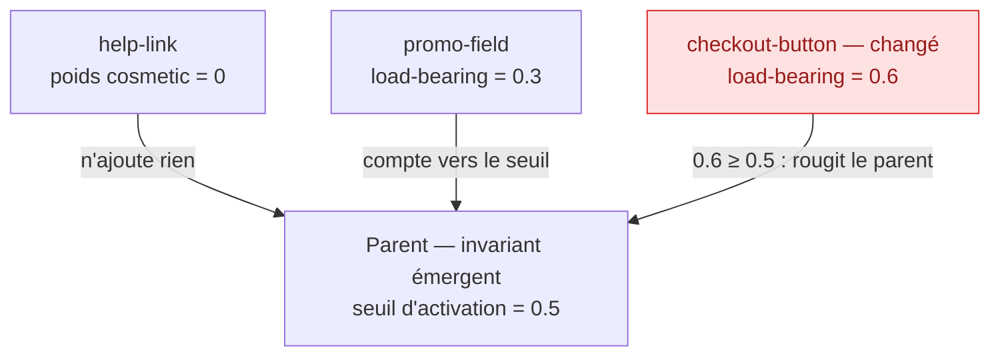

<Note>
  Côté concept — aucune ligne de code. Cette page explique *comment KRD pondère le changement* et, surtout, **pourquoi il refuse d'apprendre ses propres critères**. Pour la mécanique de propagation, voir [Le comportement, les versions et la propagation](/concepts/behavior-and-versioning) ; pour la fitness non-éditable, voir [Un système vivant](/concepts/living-system).
</Note>

## L'intuition — emprunter la topologie, refuser le réseau de neurones

Quand une sous-vérité change, faut-il tout re-prouver ? Non. La **vague de rouge** (la re-vérification qui se propage vers les parents) n'est pas binaire : elle est **pondérée et seuillée**. KRD **emprunte la topologie pondérée** d'un réseau — des liens portent un poids, des nœuds portent un seuil — mais **refuse catégoriquement le réseau de neurones dans le jugement** : aucun de ces poids n'est entraîné, ajusté par gradient, ni déduit de données.

> **La phrase à retenir :** les poids sont **déclarés** (vérité humaine, au-dessus de la ligne de flottaison), **jamais appris**. C'est la frontière qui sépare KRD d'un système qui « apprend tout seul » au mauvais sens.

## Les trois classes de poids

Chaque lien `composes` (enfant → parent) porte un **poids** qui dit *à quel point l'enfant engage l'invariant du parent* :

| Poids | Sens | Effet sur la vague de rouge |
|---|---|---|
| `cosmetic` | n'engage **pas** l'invariant du parent (un libellé, un `help-link`) | ne rougit **pas** le parent |
| `load-bearing` | **porte** un invariant du parent | rougit le parent, ou **compte vers son seuil** |
| `critical` | indispensable | rougit, et **exige une preuve** (`weight_evidence`) |

Bouger un `help-link` (cosmetic) ne réveille pas la fitness du checkout. Bouger le `checkout-button` (load-bearing), si.

## Le seuil d'activation — l'accumulation, pas l'unité

Un parent ne **rouvre** (ne rougit) son invariant émergent que si **l'une** de ces conditions est vraie :

1. la vague touche une sous-vérité **porteuse** (`load-bearing` ou `critical`), **ou**
2. l'**activation cumulée** des enfants changés **dépasse son seuil** déclaré.

Deux petits changements anodins isolément peuvent, **ensemble**, franchir le seuil et réveiller le parent. C'est l'accumulation qui décide, pas une règle « 1 enfant changé = 1 parent rouge ».

## Déclarés, jamais appris — la règle centrale

<Warning>
**Aucun poids, aucun seuil n'est entraîné.** Un poids vit **au-dessus de la ligne de flottaison** (vérité humaine), [versionné](/concepts/behavior-and-versioning) comme le reste du noyau. Le `critical` exige même une **preuve** (`weight_evidence`). Pas de gradient, pas d'apprentissage par les données, pas de réglage automatique. C'est le pendant, côté propagation, de la loi anti-Goodhart : **« poids et seuils déclarés, jamais appris »**.
</Warning>

Pourquoi cette interdiction est non-négociable :

<CardGroup cols={2}>
  <Card title="Garder le volant humain" icon="steering-wheel">
    Si le système pouvait apprendre ses propres poids, il pourrait **optimiser la métrique au lieu du but** (Goodhart). Des poids déclarés = l'humain garde le contrôle de *ce qui compte*.
  </Card>
  <Card title="Un override est une décision, pas un réglage" icon="file-signature">
    Changer un poids n'est pas un « apprentissage » : c'est une **décision enregistrée** — un ChangeSet + un ADR + sa provenance. Tracée, versionnée, réversible.
  </Card>
</CardGroup>

## Alors, qu'est-ce qui « s'améliore » dans AIDOS ?

« Auto-apprentissage » est un mot piégé. KRD sépare nettement **deux choses** que l'on confond souvent :

<AccordionGroup>
  <Accordion title="Ce qui ÉVOLUE librement — l'implémentation" icon="arrows-spin">
    L'agent réécrit le code, optimise, refactore, change d'adaptateur. Tout ce qui est **sous la ligne de flottaison** (le *comment*) évolue sans cesse. Le système **fait évoluer son implémentation** librement.
  </Accordion>
  <Accordion title="Ce qui s'ACCUMULE — la mémoire et la curation" icon="brain">
    Le **cerveau** (mémoire épisodique / sémantique / procédurale sur pgvector) accumule de l'expérience ; la **curation / QD** enrichit le corpus de vérités. Le système devient **meilleur pour se souvenir et réutiliser** — mais c'est du **rappel**, pas de l'entraînement de poids.
  </Accordion>
  <Accordion title="Ce qui n'est JAMAIS appris — les critères de succès" icon="lock">
    Les **poids**, les **seuils**, la **fitness** (le *quoi* : qu'est-ce que « réussi ») ne s'apprennent jamais. Ils sont **déclarés** et **non-éditables par l'agent**. Le système **fait évoluer l'implémentation**, **jamais ses critères de succès**.
  </Accordion>
</AccordionGroup>

> En une phrase : **AIDOS apprend à mieux *faire*, jamais à redéfinir *ce qui est bien*.** L'amélioration vit dans l'implémentation, la mémoire et la curation — pas dans un modèle qui réglerait tout seul ses propres notes.

## Où cela vit dans le système

- La **propagation pondérée** (poids + seuil) est l'étape <Badge color="blue">S19</Badge> du noyau.
- Les **seuils de fitness** (NIVEAU 3) vivent dans le schéma `fitness`, **en lecture seule** — voir [Un système vivant](/concepts/living-system).
- Un changement de poids passe par la **seule porte du noyau** : idée → miroir → `/goal` → approbation humaine → ChangeSet. Jamais une écriture en passant.

<Note>
  La pondération complète de la vague de rouge est <Badge color="orange">en cours (S19)</Badge>. Le socle (liens `composes`, agrégats récursifs) existe depuis S17/S18.
</Note>

## Pour aller plus loin

<CardGroup cols={3}>
  <Card title="La vague de rouge" icon="wave-square" href="/concepts/behavior-and-versioning">
    Comment un changement se propage — et s'arrête.
  </Card>
  <Card title="Un système vivant" icon="heart-pulse" href="/concepts/living-system">
    La fitness non-éditable, le complément de cette règle.
  </Card>
  <Card title="Les couches de preuve (N0–N5)" icon="layer-group" href="/concepts/proof-levels">
    Au-dessus / en-dessous de la ligne de flottaison.
  </Card>
</CardGroup>
